# Class Diagram

A non-exhaustive map of the main types in Turbo Vision for Rust and how they fit
together. Borland's deep inheritance tree becomes a single `View` trait plus
composition: a `Window` owns a `Frame` and an interior `Group`, a `Dialog`
wraps a `Window`, and the `Desktop` keeps its windows in a `Group`. Specialised
behaviour lives in small extension traits (`Cluster`, `ListViewer`,
`MenuViewer`, `Editor`) that require `View`.

```mermaid
classDiagram
    direction TB

    class View {
        <<trait>>
        +bounds() Rect
        +set_bounds(Rect)
        +draw(Terminal)
        +handle_event(Event)
        +can_focus() bool
        +set_focus(bool)
        +state() StateFlags
        +options() u16
        +grow_mode() GrowFlags
    }

    class IdleView {
        <<trait>>
        +idle()
    }
    class Cluster {
        <<trait>>
        +cluster_state()
    }
    class ListViewer {
        <<trait>>
        +list_state()
        +item_count() usize
    }
    class MenuViewer {
        <<trait>>
        +menu_state()
    }
    class Editor {
        <<trait>>
        +undo()
        +redo()
        +cut() bool
        +copy() bool
        +paste() bool
    }
    class FileEditor {
        <<trait>>
        +load(PathBuf)
        +save()
        +save_as(PathBuf)
    }

    View <|-- IdleView
    View <|-- Cluster
    View <|-- ListViewer
    View <|-- MenuViewer
    View <|-- Editor
    Editor <|-- FileEditor

    class Application {
        +terminal: Terminal
        +desktop: Desktop
        +menu_bar: Option~MenuBar~
        +status_line: Option~StatusLine~
        +running: bool
        +run()
        +handle_event(Event)
    }

    class Desktop {
        -children: Group
        +add(Box~View~)
        +cascade()
        +tile()
        +bring_to_front(ViewId)
    }

    class Group {
        -children: Vec~Box~View~~
        -focused: usize
        -end_state: CommandId
        +add(Box~View~) ViewId
        +execute() CommandId
        +end_modal(CommandId)
        +broadcast(Event, owner)
    }

    class Window {
        -frame: Frame
        -interior: Group
        -number: Option~u8~
        -zoom_rect: Rect
        +add(Box~View~) ViewId
        +zoom(Rect)
    }

    class Frame {
        -title: String
        -resizable: bool
        -zoomable: bool
        +is_zoomed() bool
    }

    class Dialog {
        -window: Window
        -result: CommandId
        +execute(Application) CommandId
    }

    class MenuBar {
        -submenus: Vec~SubMenu~
    }
    class MenuBox
    class StatusLine {
        -items: Vec~StatusItem~
    }

    class Button {
        -title: String
        -command: CommandId
        -is_default: bool
    }
    class InputLine
    class StaticText
    class Label
    class CheckBox
    class RadioButton
    class ListBox
    class ScrollBar
    class Scroller
    class TextViewer
    class Memo
    class EditorWindow
    class FileEditorWindow

    class Event {
        +what: EventType
        +key_code: u16
        +mouse: MouseEvent
        +command: CommandId
        +clear()
    }
    class Terminal {
        +put_event(Event)
        +flush()
    }
    class Rect
    class Palette

    Application *-- Desktop
    Application *-- Terminal
    Application o-- MenuBar
    Application o-- StatusLine
    Desktop *-- Group
    Window *-- Frame
    Window *-- Group : interior
    Dialog *-- Window
    Group o-- "0..*" View : children
    Scroller o-- ScrollBar
    TextViewer o-- ScrollBar
    MenuBar ..> MenuBox : opens

    View <|.. Desktop
    View <|.. Group
    View <|.. Window
    View <|.. Frame
    View <|.. Dialog
    View <|.. MenuBar
    View <|.. StatusLine
    View <|.. Button
    View <|.. InputLine
    View <|.. StaticText
    View <|.. Label
    View <|.. ScrollBar
    View <|.. Scroller
    View <|.. TextViewer
    View <|.. Memo
    Cluster <|.. CheckBox
    Cluster <|.. RadioButton
    ListViewer <|.. ListBox
    MenuViewer <|.. MenuBar
    MenuViewer <|.. MenuBox
    Editor <|.. EditorWindow
    FileEditor <|.. FileEditorWindow

    View ..> Event : handles
    View ..> Terminal : draws to
    View ..> Rect : bounds
    View ..> Palette : colours from
```

## Reading the diagram

Solid arrows with a hollow head between traits mean a supertrait bound, so
`Cluster: View`. Dashed arrows with a hollow head mean a struct implements the
trait. Filled diamonds are ownership by value, hollow diamonds are optional or
boxed ownership.

Two things differ from the Borland original and are worth noticing here.
First, there is no `TProgram` and `TApplication` pair: `Application` owns the
`Desktop`, `MenuBar` and `StatusLine` directly and drives the event loop.
Second, modality lives in `Group::execute`, which runs a nested loop until
`end_modal` sets `end_state`. `Dialog::execute` simply delegates to the group
inside its window and reports the resulting command.

For the full widget list see the crate documentation, and for the rationale
behind the composition-based design see
[Chapter 7: Architecture Overview](user-guide/Chapter-07-Architecture-Overview.md)
and [MISSING-INHERITANCE.md](MISSING-INHERITANCE.md).
