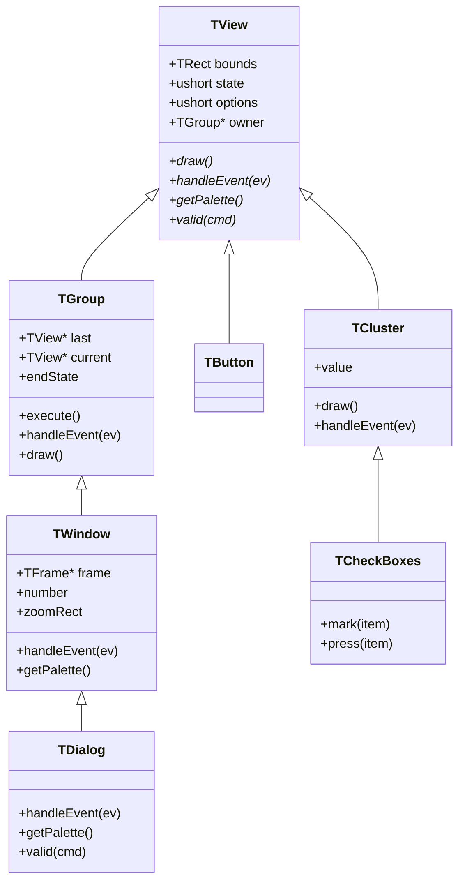
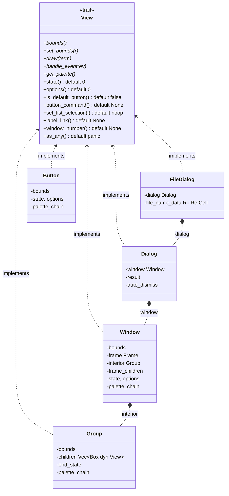
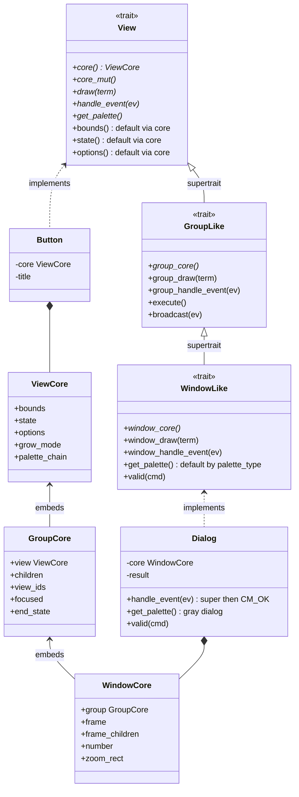
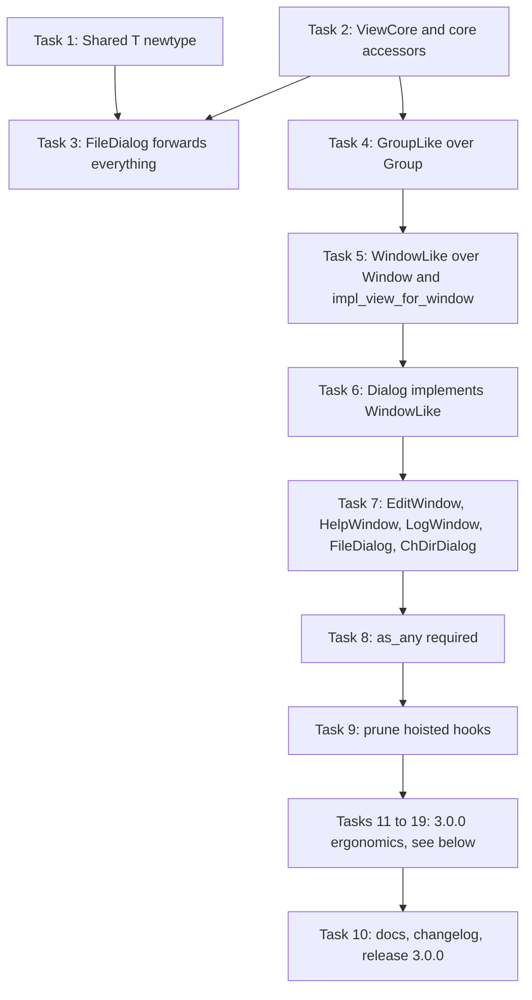
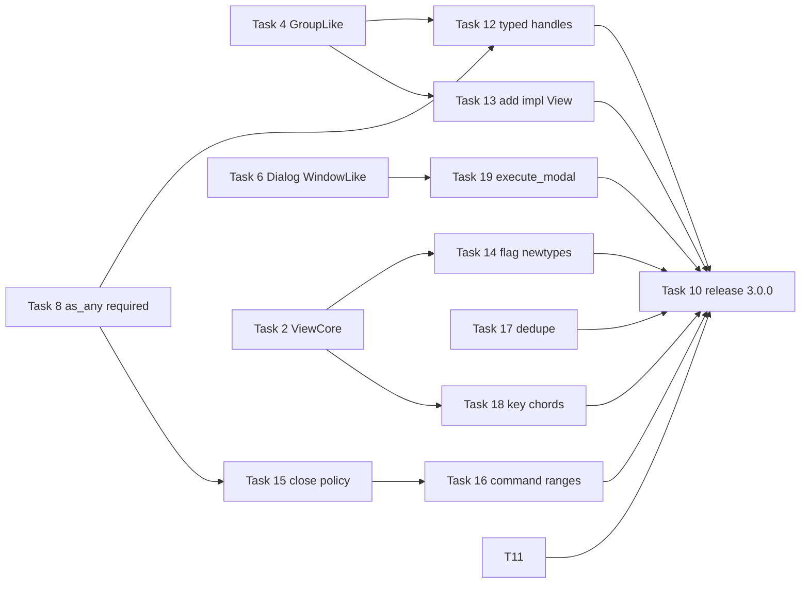

# Expressing Turbo Vision's Inheritance in Rust

Turbo Vision was designed around single inheritance. Every widget is a `TView`, every
container is a `TGroup`, and `TDialog` is a `TWindow` that overrides four methods. This
crate has no inheritance to lean on, so the hierarchy is emulated with a mixture of a
wide `View` trait, wrapper structs that delegate by hand, `Rc<RefCell<T>>` newtypes, and
a few subclass-specific hooks hoisted into the base trait. That works, and it has
shipped, but the emulation is uneven and some of it is silently wrong.

This document is an analysis, not a change. It catalogues which C++ constructs the
original relies on, how each is expressed on `main` today, where the current expression
costs something, and what a more faithful Rust shape would look like. A small standalone
probe of the proposed shape compiles and behaves as described in the last section.

## What the C++ design actually relies on

The C++ `TView` family uses five language constructs that Rust does not have in the
same form.



The first construct is data inheritance. `TView` declares `origin`, `size`, `state`,
`options`, `growMode`, `owner`, `next` once, and every one of the roughly forty
subclasses gets those fields for free.

The second is virtual dispatch with late binding into base code. `TView::getColor()`
calls `getPalette()`, which is virtual, so `TWindow::draw()` running on a `TDialog`
picks up `TDialog::getPalette()` without `TWindow` knowing dialogs exist.

The third is the explicit base call. `TDialog::handleEvent()` begins with
`TWindow::handleEvent(event)` and only then looks at `cmOk` and `cmCancel`. Almost every
override in the library has this shape: run the parent, then specialise.

The fourth is the owner back-pointer. A view can reach its parent through `owner`, and
`message(owner, evBroadcast, cmRecordHistory, 0)` or `owner->getColor()` are the
mechanisms for palette lookup, default-button discovery, focus changes, and dragging.

The fifth is runtime type information. Streamable ids, `dynamic_cast`, and the
`TView::getData()` and `setData()` pair let generic code such as `TGroup::getData()`
treat children polymorphically while dialogs still recover the concrete `TInputLine`.

## How the crate expresses each construct today

The counts below come from `main` at commit `3c46535`.

| Measure | Count |
|---|---|
| `impl View for` blocks in `src` | 56 |
| View structs that redeclare `bounds`, `state`, `options`, `palette_chain` | 32 |
| Hand-written `Shared*` newtypes wrapping `Rc<RefCell<T>>` | 7 |
| `Rc<RefCell<` occurrences under `src/views` | 70 |
| Types that implement `as_any` at all | 4 |
| Trait methods on `View` | 44 |



### Data inheritance became copy-and-paste

There is no shared base struct. `Button`, `CheckBox`, `ListBox`, `InputLine`, and
twenty-eight other leaf types each declare their own `bounds`, `state`, `options`, and
`palette_chain` fields and each write the same eight one-line getters and setters. The
trait defaults for `state()` and `options()` return zero, which is the dangerous kind of
default: a type that forgets to override them compiles and then never reports itself
as focused, modal, or closed.

The one place where the crate does share base data is the best idiom in the codebase.
`Cluster` in `src/views/cluster.rs`, `ListViewer` in `src/views/list_viewer.rs`, and
`Editor` in `src/views/editor_traits.rs` are traits that require a single accessor,
`cluster_state()` or `list_state_mut()`, and then supply real behaviour as default
methods on top of it. `CheckBox` and `RadioButton` differ only in `get_marker()` and
`on_space_pressed()`, exactly the surface `TCheckBoxes` and `TRadioButtons` override in
C++. That pattern is an abstract base class with protected data, expressed in Rust, and
it is the seed of the proposal below.

### Behaviour inheritance became hand-written delegation

`Dialog` owns a `Window`, `Window` owns a `Group`, `FileDialog` owns a `Dialog`,
`EditWindow` and `HelpWindow` own a `Window`. Each outer type implements `View` again
and forwards. `Dialog` forwards eighteen methods. This is the C++ chain rebuilt as
has-a, and it has two costs beyond the typing.

The first cost is that delegation is selective, and the compiler cannot tell a
deliberate omission from a forgotten one. `FileDialog` in `src/views/file_dialog.rs`
forwards only `bounds`, `set_bounds`, `draw`, `handle_event`, and `get_palette`. Every
other `View` method on `FileDialog` falls back to the trait default. So
`FileDialog::state()` returns zero while the inner dialog carries `SF_MODAL`,
`can_focus()` returns false, `get_end_state()` returns zero, and `as_any()` panics. The
code works today because `Dialog::execute()` drives the modal loop through the inner
`Dialog` directly and nothing asks the `FileDialog` wrapper those questions. The moment
a `FileDialog` is inserted into a `Desktop` as a `Box<dyn View>`, the desktop will see a
view with no state flags.

The second cost is the absence of late binding, covered next.

### Virtual dispatch stops at the wrapper boundary

`Window::draw()` in `src/views/window.rs` builds the palette chain node from
`self.get_palette()`. That `self` is the `Window`, so when a `Dialog` is drawn, the
`Dialog::get_palette()` override in `src/views/dialog.rs` is never consulted by the
code that actually paints. It is only correct because `Window::new_for_dialog` also sets
`WindowPaletteType::Dialog`, so the same answer is duplicated in two places and they
happen to agree. Any future subclass that wants a different palette, a different frame,
or a different `valid()` policy has to reach into the inner object with a setter, which
is why `Window` has grown `set_custom_palette`, `set_auto_close`, `set_resizable`,
`set_drag_limits`, and `set_min_size`. Each of those is a virtual method turned into a
configuration knob so the wrapper can influence code it cannot override.

### The base call works, and is the one thing that got easier

`Dialog::handle_event()` calls `self.window.handle_event(event)` first, then inspects
`CM_OK` and `CM_CANCEL`. This is a direct transliteration of `TWindow::handleEvent(event)`
at the top of `TDialog::handleEvent()`, and composition expresses it perfectly well. The
proposal keeps this property.

### The owner pointer became a chain pushed downward

Rust ownership rules out a parent back-pointer inside a `Box<dyn View>` tree without
`Rc<RefCell>` or an arena. The crate instead pushes context down. `Window::draw()` calls
`set_palette_chain` on its frame, its interior group, and every frame child on every
frame, so that `map_color()` can walk upward through cloned nodes. Positioning does the
same through `set_parent_bounds`, `init_after_add`, and `constrain_to_parent_bounds`.
These three hooks exist only because there is no `owner`, and the dialog end state has to
be threaded back up through `get_end_state` and `set_end_state` on the trait for the
same reason.

### Runtime type information became a wide trait

`as_any()` panics by default and is implemented by four types. Rather than downcast, the
crate lifts subclass API into `View`: `is_default_button`, `button_command`,
`set_list_selection`, `get_list_selection`, `label_link`, `window_number`,
`get_end_state`, `set_end_state`. Each is a method that makes sense on one or two types
and is a no-op on the other fifty. C++ Turbo Vision does some of this too, notably
`getData`, `setData`, `dataSize`, and `valid` live on `TView`, but for the default button
it broadcasts `cmDefault` to the owner rather than asking every child whether it is a
button.

### Shared children became seven identical newtypes

`EditWindow` needs to both insert its `EditorWindow` into the window's group and keep
calling `load_file` on it afterwards. In C++ that is a `TEditor* editor` field pointing
at a child the group owns. Here it is `Rc<RefCell<EditorWindow>>` plus a
`SharedEditor(Rc<RefCell<EditorWindow>>)` newtype whose `View` impl forwards every
method through `borrow()`. The same newtype is written by hand for `ScrollBar` twice,
`Indicator`, `HelpViewer`, `TerminalWidget`, and `DirListBox`. There is no generic
`Shared<T>`.

## Side by side with the C++ model

| Construct | C++ Turbo Vision | Crate on `main` | Where it hurts |
|---|---|---|---|
| Base fields | Declared once in `TView` | Redeclared in 32 structs | Zero-returning defaults hide omissions |
| Base behaviour | Inherited, override per method | Wrapper struct, forward per method | Partial forwarding, see `FileDialog` |
| Late binding | Virtual calls from base code | None across a wrapper boundary | `Dialog::get_palette` is dead code |
| Base call | `TWindow::handleEvent(ev)` | `self.window.handle_event(ev)` | Fine |
| Owner pointer | `owner` field, `message(owner, ...)` | Palette chain pushed down each draw, three lifecycle hooks | Per-frame cloning, extra trait surface |
| RTTI | `dynamic_cast`, streamable ids | `as_any` on 4 types, 8 hoisted hooks | Panicking default, 44-method trait |
| Shared child | Raw pointer to owned child | 7 hand-written `Rc<RefCell>` newtypes | Boilerplate, double borrow hazards |
| Abstract base with data | `TCluster`, `TListViewer` | `Cluster`, `ListViewer` traits with state accessor | Works well, not applied to containers |

## A more faithful Rust shape

The idea is to take the `Cluster` pattern that already works for leaf families and apply
it to the container spine. Each C++ class becomes a pair: a plain struct holding the
class's own fields, and a trait holding the class's behaviour as default methods that
call other trait methods. Because default methods dispatch through `self`, an override
in an outer type is visible to base code, which is exactly the late binding the wrapper
approach loses.



### Layer one: a `ViewCore` for the base fields

`View` gains two required methods, `core(&self) -> &ViewCore` and `core_mut`, and the
eight accessors for bounds, state, options, grow mode, and palette chain become default
methods that read the core. This alone removes about 250 near-identical method bodies
and, more importantly, removes the zero-returning defaults: a view cannot forget to
report its state because it does not implement `state()` at all. `map_color`,
`shadow_bounds`, `make_local`, and the other helpers already written against the
accessors keep working unchanged.

### Layer two: traits for `Group` and `Window` behaviour

`GroupLike: View` requires `group_core()` and provides the current `Group` body as
default methods. `WindowLike: GroupLike` requires `window_core()` and provides the
current `Window` body. `Dialog` then becomes a struct with a `WindowCore` field and an
`impl WindowLike for Dialog` that overrides three methods, which is what `TDialog` is.

Two details make this work in Rust where a naive attempt does not.

The first is naming the inherited implementation. Rust has no `super`, and an override
of `handle_event` cannot call the default it replaced. The fix is to give the default a
second name: `WindowLike` provides `fn window_handle_event(&mut self, ev)` containing the
real body and `fn handle_event(&mut self, ev) { self.window_handle_event(ev) }` as a
one-line default. `Dialog::handle_event` calls `self.window_handle_event(ev)` first and
then checks `CM_OK`. That is `TWindow::handleEvent(event)` spelled in Rust, and it is the
same shape `Cluster::handle_cluster_event` already uses.

The second is how a `WindowLike` type gets its `View` implementation. There are two
options.

A blanket `impl<T: WindowLike> View for T` compiles alongside a plain
`impl View for Button` because both traits and both types are local to the crate, so
the coherence checker can see that `Button` does not implement `WindowLike`. The probe
in the last section confirms this on rustc 1.98. The drawback is that `View` can then
not be a supertrait of `WindowLike`, which forfeits trait upcasting from
`Box<dyn WindowLike>` to `Box<dyn View>`.

The alternative keeps `WindowLike: View` as a supertrait and generates the forwarding
`impl View for Dialog` with a small declarative macro, `impl_view_via_window!(Dialog)`.
The macro body is the same for every window type, so the selective-forwarding bug that
bit `FileDialog` cannot recur, and trait upcasting, stable since Rust 1.86, still works.
This is the recommended variant. It is slightly more ceremony per type but keeps the
trait graph a straight line, which matters for `Desktop` and `Group` that store
`Box<dyn View>`.

Method name collisions between `View::draw` and `WindowLike::draw` are resolved with
fully qualified calls inside the macro, `WindowLike::draw(self, term)`, and do not leak
to users.

### What this buys back

Late binding returns. `window_draw` calls `self.get_palette()`, and for a `Dialog` that
resolves to `Dialog::get_palette`. The `WindowPaletteType::Dialog` variant and the
`set_custom_palette` knob can go, because a subclass overrides `get_palette` the way the
C++ does. The same applies to `valid`, `zoom`, and eventually the frame choice.

Partial forwarding becomes impossible. Either a type is `WindowLike` and gets the whole
surface, or it is not.

The `Shared*` newtypes shrink to one. With `GroupLike` exposing `child_by_id_mut` from
its core, `EditWindow` can hold the editor's `ViewId` and fetch it through the group when
it needs `load_file`, downcasting once through a real `as_any`. Where a genuinely shared
handle is still needed, one generic `Shared<T: View>` with a single blanket `View`
implementation replaces the seven hand-written copies. This second part does not depend
on the layered traits and could be done first.

The hoisted hooks can be pruned to the ones C++ also has. `get_end_state` and
`set_end_state` move to `GroupLike` where `endState` lives. `is_default_button` and
`button_command` can be replaced by broadcasting `CM_DEFAULT` the way `TDialog` does, or
kept but moved off `View`. `set_list_selection` and `get_list_selection` are already
covered by the `ListViewer` trait and can be reached with a downcast once `as_any` stops
being optional. `label_link` and `window_number` are the kind of thing `TView` also
carries, and can stay.

### What it does not fix

The owner pointer stays missing. The layered traits do not give a child a way to reach
its parent, so the pushed-down palette chain and the `set_parent_bounds` family remain.
A cheaper improvement inside the current design is to set the chain once in
`init_after_add` and on `set_bounds` instead of cloning it into every child on every
draw. A full fix needs either an arena with indices or `Rc<RefCell>` parents, and both
are a larger change than this document proposes.

Downcasting stays explicit. Rust will not give `dynamic_cast` for free, but making
`as_any` a required method, or generating it in the same macro, turns the current panic
into a compile-time guarantee.

### Alternatives considered

Implementing `Deref<Target = Window>` for `Dialog` gives field access but does not
implement `View`, and it inverts the meaning of `Deref` as a smart-pointer trait. It is
the idiom the Rust API guidelines specifically warn against for inheritance emulation.

The `delegate` and `ambassador` crates automate forwarding but still forward to an inner
object, so they inherit the late-binding problem and add a dependency to a crate that
currently has few.

Making `Window<I: Interior>` generic gives static dispatch and late binding through the
type parameter, in the spirit of C++ CRTP, but every window type becomes a distinct
monomorphised type, `Box<dyn View>` still needs a trait, and error messages get worse
for downstream users.

An `enum ViewKind { Button(Button), Dialog(Dialog), ... }` would give exhaustive matching
and cheap downcasts but closes the set of views. Downstream crates define their own
views today, so the set must stay open.

## Evidence from a standalone probe

The layered shape was checked outside the crate with a program containing a `Core`
struct, a `View` trait with `core()` accessors and defaults, a `WindowLike` trait with
`window_core()`, a named `window_draw` and `window_handle_event`, a blanket
`impl<T: WindowLike> View for T`, a plain `impl View for Button`, a `Window` that
implements only the accessors, and a `Dialog` that overrides `get_palette` and
`handle_event` with a base call first. Compiled with rustc 1.98.0, edition 2024, it
printed:

```text
["button", "frame[w] window", "frame[d] dialog"] ev=0 state=5
```

The third entry shows base `window_draw` code picking up the `Dialog` palette override.
`ev=0` shows the base handler ran before the dialog-specific one and both saw the event.
`state=5` shows the `View::state()` default reading through two levels of core structs.
Adding `View` as a supertrait of `WindowLike` while keeping the blanket impl fails to
compile, which is why the macro variant is recommended when upcasting is wanted.

## Suggested order if this is ever pursued

Start with the generic `Shared<T>` newtype, since it is self-contained and removes six
files' worth of duplication. Then introduce `ViewCore` and the `core()` accessors on
`View`, migrating leaf views one file at a time while the old field-based impls keep
compiling. Only then lift `Group` and `Window` bodies into `GroupLike` and `WindowLike`,
converting `Dialog`, `EditWindow`, `HelpWindow`, `LogWindow`, `FileDialog`, and
`ChDirDialog` to implement the traits over a `WindowCore`. Trimming the hoisted hooks
from `View` is the last step, once `as_any` is guaranteed and `ListViewer` and
`GroupLike` have taken over the methods that belong to them.

---

# Implementation Plan

> **For agentic workers:** REQUIRED SUB-SKILL: Use superpowers:subagent-driven-development (recommended) or superpowers:executing-plans to implement this plan task-by-task. Steps use checkbox (`- [ ]`) syntax for tracking.

**Goal:** Replace the hand-written delegation and duplicated base fields in the `View` hierarchy with a `ViewCore` struct plus layered `GroupLike` and `WindowLike` traits, so that overrides in `Dialog` and other window types are seen by the base drawing and event code, and partial forwarding cannot happen again.

**Architecture:** Each Turbo Vision class becomes a plain struct holding that class's own fields and a trait holding its behaviour as default methods. `View` gains `core()` and `core_mut()` accessors returning a `ViewCore`, and its field accessors become defaults. `Group` and `Window` keep their struct names and become the cores; `GroupLike` and `WindowLike` carry their bodies as named defaults (`group_handle_event`, `window_draw`) so an override can make a base call. A declarative macro `impl_view_for_window!` generates the `View` impl for every window-shaped type.

**Tech Stack:** Rust 1.98, edition 2024, no new dependencies. Tests use the existing `#[cfg(test)]` modules and `crate::test_util::MockTerminal`.

## Global Constraints

- No new crates in `Cargo.toml`. The `delegate` and `ambassador` crates are explicitly rejected above.
- Every task must leave `cargo build --all-targets` and `cargo test` green. Run `cargo clippy --all-targets -- -D warnings` before each commit; the crate is clippy-clean today.
- Public API of leaf views (`Button::new`, `ListBox::set_items`, builders) must not change. Downstream crates implement `View` for their own types, so every task that adds a required method to `View` must document it in `CHANGELOG.md` under an `Unreleased` heading and the release at the end is a major version, `2.3.1` to `3.0.0`. Tasks 1 to 9 are the inheritance work; Tasks 11 to 19 below are the additional breaking ergonomics changes that ride on the same major.
- Method bodies moved from a struct impl into a trait default must be moved verbatim except for the `self.field` to `self.group()` or `self.window()` rewrites. Behaviour changes belong in their own task.
- Every file keeps its `// (C) 2025 - Enzo Lombardi` or `// (C) 2026 - Enzo Lombardi` header. New files use 2026.
- Commit after every task with the `feat(views):` or `refactor(views):` prefix already used in the history.

## Task map



Task 1 and Task 2 are independent and can run in parallel.

---

### Task 1: One generic `Shared<T>` replaces six hand-written newtypes

**Files:**
- Create: `src/views/shared.rs`
- Modify: `src/views/mod.rs:110` (add `pub mod shared;` in alphabetical order after `pub mod scroller;`)
- Modify: `src/views/edit_window.rs:24-165` (delete `SharedScrollBar`, `SharedIndicator`, `SharedEditor`)
- Modify: `src/views/help_window.rs:25-69` (delete `SharedHelpViewer`)
- Modify: `src/views/log_window.rs:155-190` (delete `SharedTerminalWidget`)
- Modify: `src/views/chdir_dialog.rs:45-70` (delete `SharedScrollBar`; keep `SharedDirListBox`, it has extra behaviour)
- Test: `src/views/shared.rs` (inline `#[cfg(test)]`)

**Interfaces:**
- Produces: `pub struct Shared<T: View>(pub Rc<RefCell<T>>, Option<PaletteChainNode>)` with `pub fn new(inner: Rc<RefCell<T>>) -> Self` and `pub fn inner(&self) -> &Rc<RefCell<T>>`. `impl<T: View> View for Shared<T>` forwards every `View` method that the six deleted newtypes forwarded, plus `is_focused`, `grow_mode`, `set_grow_mode`, `update_cursor`, `valid`, `get_end_state`, `set_end_state`, `init_after_add`, `constrain_to_parent_bounds`, `set_parent_bounds`, `label_link`, `window_number`, `is_default_button`, `button_command`, `set_list_selection`, `get_list_selection`.
- `get_palette_chain` returns a reference to the wrapper's own copy. The deleted newtypes returned `None` here, which was lossy; the copy keeps the chain observable.

- [x] **Step 1: Write the failing test**

```rust
// src/views/shared.rs
#[cfg(test)]
mod tests {
    use super::*;
    use crate::core::geometry::Rect;
    use crate::core::palette_chain::PaletteChainNode;
    use crate::core::state::{SF_FOCUSED, SF_VISIBLE};
    use crate::views::scrollbar::ScrollBar;

    #[test]
    fn shared_forwards_state_and_bounds_both_ways() {
        let inner = Rc::new(RefCell::new(ScrollBar::new_vertical(Rect::new(0, 0, 1, 10))));
        let mut shared = Shared::new(Rc::clone(&inner));

        shared.set_state(SF_VISIBLE | SF_FOCUSED);
        assert_eq!(inner.borrow().state(), SF_VISIBLE | SF_FOCUSED);

        inner.borrow_mut().set_bounds(Rect::new(5, 5, 6, 15));
        assert_eq!(shared.bounds(), Rect::new(5, 5, 6, 15));
    }

    #[test]
    fn shared_keeps_an_observable_palette_chain() {
        let inner = Rc::new(RefCell::new(ScrollBar::new_vertical(Rect::new(0, 0, 1, 10))));
        let mut shared = Shared::new(Rc::clone(&inner));
        assert!(shared.get_palette_chain().is_none());

        shared.set_palette_chain(Some(PaletteChainNode::new(None, None)));
        assert!(shared.get_palette_chain().is_some());
        assert!(inner.borrow().get_palette_chain().is_some());
    }
}
```

- [x] **Step 2: Run the test to verify it fails**

Run: `cargo test --lib views::shared`
Expected: compile error, `unresolved import` for `views::shared`.

- [x] **Step 3: Write the implementation**

```rust
// (C) 2026 - Enzo Lombardi

//! `Shared<T>` lets one view be both a child owned by a `Group` and a handle
//! held by its parent struct. Borland does this with a raw `TEditor*` into
//! the owner's child list; Rust needs `Rc<RefCell<T>>`. This is the single
//! forwarding wrapper that replaces the per-type `SharedScrollBar`,
//! `SharedEditor`, `SharedIndicator`, `SharedHelpViewer` and
//! `SharedTerminalWidget` newtypes.

use super::view::{View, ViewId};
use crate::core::command::CommandId;
use crate::core::event::Event;
use crate::core::geometry::Rect;
use crate::core::palette::Palette;
use crate::core::palette_chain::PaletteChainNode;
use crate::core::state::{GrowFlags, StateFlags};
use crate::terminal::Terminal;
use std::cell::RefCell;
use std::rc::Rc;

pub struct Shared<T: View> {
    inner: Rc<RefCell<T>>,
    /// Mirror of the inner view's chain so `get_palette_chain` can hand out
    /// a reference (a `RefCell` borrow cannot escape).
    palette_chain: Option<PaletteChainNode>,
}

impl<T: View> Shared<T> {
    pub fn new(inner: Rc<RefCell<T>>) -> Self {
        Self { inner, palette_chain: None }
    }

    pub fn inner(&self) -> &Rc<RefCell<T>> {
        &self.inner
    }
}

impl<T: View> View for Shared<T> {
    fn bounds(&self) -> Rect { self.inner.borrow().bounds() }
    fn set_bounds(&mut self, bounds: Rect) { self.inner.borrow_mut().set_bounds(bounds); }
    fn draw(&mut self, terminal: &mut Terminal) { self.inner.borrow_mut().draw(terminal); }
    fn handle_event(&mut self, event: &mut Event) { self.inner.borrow_mut().handle_event(event); }
    fn can_focus(&self) -> bool { self.inner.borrow().can_focus() }
    fn set_focus(&mut self, focused: bool) { self.inner.borrow_mut().set_focus(focused); }
    fn is_focused(&self) -> bool { self.inner.borrow().is_focused() }
    fn window_number(&self) -> Option<u8> { self.inner.borrow().window_number() }
    fn options(&self) -> u16 { self.inner.borrow().options() }
    fn set_options(&mut self, options: u16) { self.inner.borrow_mut().set_options(options); }
    fn state(&self) -> StateFlags { self.inner.borrow().state() }
    fn set_state(&mut self, state: StateFlags) { self.inner.borrow_mut().set_state(state); }
    fn grow_mode(&self) -> GrowFlags { self.inner.borrow().grow_mode() }
    fn set_grow_mode(&mut self, grow_mode: GrowFlags) { self.inner.borrow_mut().set_grow_mode(grow_mode); }
    fn update_cursor(&self, terminal: &mut Terminal) { self.inner.borrow().update_cursor(terminal); }
    fn zoom(&mut self, max_bounds: Rect) { self.inner.borrow_mut().zoom(max_bounds); }
    fn valid(&mut self, command: CommandId) -> bool { self.inner.borrow_mut().valid(command) }
    fn is_default_button(&self) -> bool { self.inner.borrow().is_default_button() }
    fn button_command(&self) -> Option<u16> { self.inner.borrow().button_command() }
    fn set_list_selection(&mut self, index: usize) { self.inner.borrow_mut().set_list_selection(index); }
    fn get_list_selection(&self) -> usize { self.inner.borrow().get_list_selection() }
    fn get_end_state(&self) -> CommandId { self.inner.borrow().get_end_state() }
    fn set_end_state(&mut self, command: CommandId) { self.inner.borrow_mut().set_end_state(command); }
    fn label_link(&self) -> Option<ViewId> { self.inner.borrow().label_link() }
    fn init_after_add(&mut self) { self.inner.borrow_mut().init_after_add(); }
    fn constrain_to_parent_bounds(&mut self) { self.inner.borrow_mut().constrain_to_parent_bounds(); }
    fn set_parent_bounds(&mut self, bounds: Rect) { self.inner.borrow_mut().set_parent_bounds(bounds); }
    fn get_palette(&self) -> Option<Palette> { self.inner.borrow().get_palette() }

    fn set_palette_chain(&mut self, node: Option<PaletteChainNode>) {
        self.palette_chain = node.clone();
        self.inner.borrow_mut().set_palette_chain(node);
    }

    fn get_palette_chain(&self) -> Option<&PaletteChainNode> {
        self.palette_chain.as_ref()
    }
}
```

`as_any` and `as_any_mut` are deliberately not forwarded: they must return the wrapper itself, and Task 8 makes them required, at which point add `fn as_any(&self) -> &dyn std::any::Any { self }` and the `_mut` twin here.

- [x] **Step 4: Run the test to verify it passes**

Run: `cargo test --lib views::shared`
Expected: `test result: ok. 2 passed`.

- [x] **Step 5: Replace the six newtypes**

In `src/views/edit_window.rs` delete lines 23 through 165 (the three `Shared*` structs and their `View` impls) and change the three `window.add(...)` calls in `EditWindow::new`:

```rust
use super::shared::Shared;
// ...
window.add(Box::new(Shared::new(Rc::clone(&editor))));
let h_scrollbar_idx = window.add_frame_child(Box::new(Shared::new(Rc::clone(&h_scrollbar))));
let v_scrollbar_idx = window.add_frame_child(Box::new(Shared::new(Rc::clone(&v_scrollbar))));
let indicator_idx = window.add_frame_child(Box::new(Shared::new(Rc::clone(&indicator))));
```

Apply the same substitution in `help_window.rs` (`SharedHelpViewer(x)` becomes `Shared::new(x)`), `log_window.rs` (`SharedTerminalWidget(x)`), and `chdir_dialog.rs` (`SharedScrollBar(x)` only). Then remove the now-unused `use` lines the compiler reports.

- [x] **Step 6: Run the full suite**

Run: `cargo test && cargo clippy --all-targets -- -D warnings`
Expected: all tests pass, no warnings. In particular `edit_window::tests::editor_follows_window_resize` and `help_window::tests::test_help_window_options_delegation` must still pass; they exercise the forwarded `set_bounds` and `options`.

- [x] **Step 7: Commit**

```bash
git add src/views/shared.rs src/views/mod.rs src/views/edit_window.rs src/views/help_window.rs src/views/log_window.rs src/views/chdir_dialog.rs
git commit -m "refactor(views): generic Shared<T> replaces six Rc<RefCell> forwarding newtypes"
```

---

### Task 2: `ViewCore` holds the fields every view redeclares

**Files:**
- Modify: `src/views/view.rs` (add `ViewCore`, add `core`/`core_mut`, turn field accessors into defaults)
- Modify: every leaf view file listed in Step 4 (32 files)
- Test: `src/views/view.rs` (inline), `src/views/button.rs` (existing tests must keep passing)

**Interfaces:**
- Produces:

```rust
#[derive(Debug, Clone, Default)]
pub struct ViewCore {
    pub bounds: Rect,
    pub state: StateFlags,
    pub options: u16,
    pub grow_mode: GrowFlags,
    pub palette_chain: Option<PaletteChainNode>,
}
impl ViewCore {
    pub fn new(bounds: Rect) -> Self;                       // state 0, options 0
    pub fn with_options(bounds: Rect, options: u16) -> Self;
}
// on View:
fn core(&self) -> &ViewCore;
fn core_mut(&mut self) -> &mut ViewCore;
```

- After this task the following `View` methods have defaults that read the core and are no longer overridden by leaf views: `bounds`, `set_bounds`, `state`, `set_state`, `options`, `set_options`, `grow_mode`, `set_grow_mode`, `set_palette_chain`, `get_palette_chain`.

The migration is staged so the crate compiles after every file. Step 2 gives `core()` a temporary default that panics with a clear message; only unmigrated leaf views could reach it, and they never do because they still override every accessor. Step 5 removes that default and the compiler lists everything left.

- [x] **Step 1: Write the failing test**

```rust
// src/views/view.rs, inside a new #[cfg(test)] mod tests
#[test]
fn accessors_read_and_write_the_core() {
    struct Probe(ViewCore);
    impl View for Probe {
        fn core(&self) -> &ViewCore { &self.0 }
        fn core_mut(&mut self) -> &mut ViewCore { &mut self.0 }
        fn draw(&mut self, _t: &mut Terminal) {}
        fn handle_event(&mut self, _e: &mut Event) {}
        fn get_palette(&self) -> Option<crate::core::palette::Palette> { None }
    }
    let mut p = Probe(ViewCore::new(Rect::new(1, 2, 3, 4)));
    assert_eq!(p.bounds(), Rect::new(1, 2, 3, 4));
    p.set_state(SF_FOCUSED);
    assert!(p.is_focused());
    p.set_options(0x0004);
    assert_eq!(p.options(), 0x0004);
    p.set_bounds(Rect::new(0, 0, 8, 8));
    assert_eq!(p.core().bounds, Rect::new(0, 0, 8, 8));
}
```

- [x] **Step 2: Run it to verify it fails**

Run: `cargo test --lib views::view::tests`
Expected: compile error, `cannot find type ViewCore`, and `not all trait items implemented, missing: bounds, set_bounds`.

- [x] **Step 3: Add `ViewCore` and the defaults**

At the top of `src/views/view.rs`, after the `ViewId` impl:

```rust
/// The fields Borland declares once in `TView` and every subclass inherits.
/// Each view owns exactly one of these and hands it back from `View::core()`.
#[derive(Debug, Clone, Default)]
pub struct ViewCore {
    pub bounds: Rect,
    pub state: StateFlags,
    pub options: u16,
    pub grow_mode: crate::core::state::GrowFlags,
    pub palette_chain: Option<crate::core::palette_chain::PaletteChainNode>,
}

impl ViewCore {
    pub fn new(bounds: Rect) -> Self {
        Self { bounds, ..Self::default() }
    }

    pub fn with_options(bounds: Rect, options: u16) -> Self {
        Self { bounds, options, ..Self::default() }
    }
}
```

Inside `pub trait View`, replace the existing `bounds`, `set_bounds`, `options`, `set_options`, `state`, `set_state`, `grow_mode`, `set_grow_mode`, `set_palette_chain`, `get_palette_chain` declarations with:

```rust
    /// Base fields shared by every view (Borland: the `TView` data members).
    ///
    /// TEMPORARY DEFAULT: removed in Task 2 Step 5 once every view provides it.
    fn core(&self) -> &ViewCore {
        unreachable!("View::core() must be implemented by every view type")
    }
    fn core_mut(&mut self) -> &mut ViewCore {
        unreachable!("View::core_mut() must be implemented by every view type")
    }

    fn bounds(&self) -> Rect { self.core().bounds }
    fn set_bounds(&mut self, bounds: Rect) { self.core_mut().bounds = bounds; }
    fn state(&self) -> StateFlags { self.core().state }
    fn set_state(&mut self, state: StateFlags) { self.core_mut().state = state; }
    fn options(&self) -> u16 { self.core().options }
    fn set_options(&mut self, options: u16) { self.core_mut().options = options; }
    fn grow_mode(&self) -> crate::core::state::GrowFlags { self.core().grow_mode }
    fn set_grow_mode(&mut self, grow_mode: crate::core::state::GrowFlags) { self.core_mut().grow_mode = grow_mode; }
    fn set_palette_chain(&mut self, node: Option<crate::core::palette_chain::PaletteChainNode>) { self.core_mut().palette_chain = node; }
    fn get_palette_chain(&self) -> Option<&crate::core::palette_chain::PaletteChainNode> { self.core().palette_chain.as_ref() }
```

Run `cargo test --lib views::view::tests`. Expected: PASS. Run `cargo test`. Expected: everything still passes, because every existing view still overrides these accessors.

- [x] **Step 4: Migrate the leaf views one file at a time**

For each file below, in this order, do the following and run `cargo test --lib views::<module>` after each file:

1. Replace the `bounds: Rect`, `state: StateFlags`, `options: u16`, `grow_mode`, `palette_chain: Option<PaletteChainNode>` fields in the struct with a single `core: ViewCore`.
2. In the constructor, build `core: ViewCore::with_options(bounds, <the options value the constructor used>)` and set `core.state` where the constructor set `state`.
3. Delete the `bounds`, `set_bounds`, `state`, `set_state`, `options`, `set_options`, `grow_mode`, `set_grow_mode`, `set_palette_chain`, `get_palette_chain` methods from the `impl View for X` block **only if their body was a plain field read or write**. A `set_bounds` that also repositions children stays, rewritten as `self.core.bounds = bounds; ...`.
4. Add to the `impl View for X` block:

```rust
    fn core(&self) -> &ViewCore { &self.core }
    fn core_mut(&mut self) -> &mut ViewCore { &mut self.core }
```

5. Replace every remaining `self.bounds` with `self.core.bounds`, `self.state` with `self.core.state`, `self.options` with `self.core.options`, `self.palette_chain` with `self.core.palette_chain`. Where a struct already has a field named `state` for something else (`ListBox` has `list_state`, `CheckBox` has `cluster_state`), leave those alone.

Files, in dependency order so that tests for containers keep compiling: `static_text.rs`, `label.rs`, `paramtext.rs`, `background.rs`, `ansi_background.rs`, `button.rs`, `checkbox.rs`, `radiobutton.rs`, `input_line.rs`, `scrollbar.rs`, `indicator.rs`, `frame.rs`, `listbox.rs`, `sorted_listbox.rs`, `file_list.rs`, `dir_listbox.rs`, `history.rs`, `history_viewer.rs`, `list_viewer.rs` (no fields, skip if none), `menu_bar.rs`, `menu_box.rs`, `status_line.rs`, `outline.rs`, `text_viewer.rs`, `scroller.rs`, `memo.rs`, `editor.rs`, `file_editor.rs`, `terminal_widget.rs`, `help_viewer.rs`, `help_index.rs`, `help_toc.rs`, `color_selector.rs`, `kitty_image.rs`, `validator.rs` (skip if it holds no view fields).

Example for `src/views/button.rs`, the struct becomes:

```rust
pub struct Button {
    core: ViewCore,
    title: String,
    command: CommandId,
    is_default: bool,
    am_default: bool,
    pressed: bool,
    is_broadcast: bool,
}
```

and the constructor's tail becomes:

```rust
        let mut core = ViewCore::with_options(bounds, OF_POST_PROCESS);
        if !command_set::command_enabled(command) {
            core.state |= SF_DISABLED;
        }
        Self { core, title: title.to_string(), command, is_default, am_default: is_default, pressed: false, is_broadcast: false }
```

Containers (`group.rs`, `window.rs`, `desktop.rs`) and wrappers (`dialog.rs`, `edit_window.rs`, `help_window.rs`, `log_window.rs`, `file_dialog.rs`, `chdir_dialog.rs`, `color_dialog.rs`, `msgbox.rs`, `history_window.rs`) are handled in Step 5, not here.

- [x] **Step 5: Make `core()` required**

Delete the two `unreachable!` default bodies so `core` and `core_mut` are required. Run `cargo build --all-targets`. The compiler now lists every type without a core. Fix each:

- `Group`: replace `bounds`, `palette_chain`, `grow_mode` fields with `core: ViewCore`; add `fn core(&self) -> &ViewCore { &self.core }` and `_mut`. Its `set_bounds` override stays because it cascades to children.
- `Window`: same, replacing `bounds`, `state`, `options`, `palette_chain`, `grow_mode`. Its `set_bounds` override stays.
- `Desktop`: same treatment for whatever base fields it holds.
- Wrappers (`Dialog`, `EditWindow`, `HelpWindow`, `LogWindow`, `FileDialog`, `ChDirDialog`, `ColorDialog`, `HistoryWindow`, and any type in `msgbox.rs`): forward, `fn core(&self) -> &ViewCore { self.window.core() }` or `self.dialog.core()`. Then delete their forwarding `bounds`, `state`, `set_state`, `options`, `set_options`, `grow_mode`, `set_grow_mode`, `get_palette_chain`, `set_palette_chain` methods, which the defaults now cover. Keep any `set_bounds` that does extra work (`EditWindow::set_bounds` repositions frame children).
- `Shared<T>` from Task 1: `fn core(&self) -> &ViewCore` cannot return a reference through a `RefCell`. Keep its explicit forwarding accessors, and implement `core()` by keeping a mirrored `ViewCore` the same way it mirrors `palette_chain`: on every `set_*` call, write to both. Add `fn core(&self) -> &ViewCore { &self.core }` and `fn core_mut(&mut self) -> &mut ViewCore { &mut self.core }` and a test asserting `shared.core().state == inner.borrow().state()` after `set_state`.
- Any test-only view structs in `#[cfg(test)]` modules (search `impl View for` inside `mod tests`): give them a `ViewCore` field.

Run: `cargo test && cargo clippy --all-targets -- -D warnings`
Expected: green. `grep -rn "fn state(&self)" src/views | wc -l` should now report only the `Shared<T>` impl and the trait default.

- [x] **Step 6: Commit**

```bash
git add -A src/views src/app
git commit -m "refactor(views): ViewCore holds the TView base fields; accessors become trait defaults"
```

---

### Task 3: `FileDialog` stops forwarding selectively

This is the bug found in the analysis. Task 2 already fixed `state` and `options` through `core()`. The remaining gaps are `can_focus`, `set_focus`, `update_cursor`, `valid`, `get_end_state`, `set_end_state`, `init_after_add`, `constrain_to_parent_bounds`, `as_any`, `as_any_mut`. Task 7 replaces this impl with the macro; this task closes the hole now so the behaviour is pinned by a test before the refactor.

**Files:**
- Modify: `src/views/file_dialog.rs:791-836`
- Test: `src/views/file_dialog.rs` (inline tests module, create if absent)

- [x] **Step 1: Write the failing test**

```rust
#[cfg(test)]
mod forwarding_tests {
    use super::*;
    use crate::core::state::SF_MODAL;

    #[test]
    fn file_dialog_reports_the_inner_dialogs_state_and_end_state() {
        let mut fd = FileDialog::new(Rect::new(0, 0, 60, 20), "Open", "*.rs", None);
        fd.set_state(fd.state() | SF_MODAL);
        assert_ne!(View::state(&fd) & SF_MODAL, 0);
        assert!(fd.can_focus());
        fd.set_end_state(CM_OK);
        assert_eq!(View::get_end_state(&fd), CM_OK);
        assert!(fd.as_any().downcast_ref::<FileDialog>().is_some());
    }
}
```

The signature is `FileDialog::new(bounds: Rect, title: &str, wildcard: &str, initial_dir: Option<PathBuf>)` at `src/views/file_dialog.rs:222`.

- [x] **Step 2: Run it to verify it fails**

Run: `cargo test --lib views::file_dialog::forwarding_tests`
Expected: `assertion failed: fd.can_focus()` (the trait default is `false`), or the `as_any` panic.

- [x] **Step 3: Forward the missing methods**

Add to `impl View for FileDialog`:

```rust
    fn can_focus(&self) -> bool { self.dialog.can_focus() }
    fn set_focus(&mut self, focused: bool) { self.dialog.set_focus(focused); }
    fn update_cursor(&self, terminal: &mut Terminal) { self.dialog.update_cursor(terminal); }
    fn valid(&mut self, command: CommandId) -> bool { self.dialog.valid(command) }
    fn get_end_state(&self) -> CommandId { View::get_end_state(&self.dialog) }
    fn set_end_state(&mut self, command: CommandId) { View::set_end_state(&mut self.dialog, command); }
    fn init_after_add(&mut self) { self.dialog.init_after_add(); }
    fn constrain_to_parent_bounds(&mut self) { self.dialog.constrain_to_parent_bounds(); }
    fn as_any(&self) -> &dyn std::any::Any { self }
    fn as_any_mut(&mut self) -> &mut dyn std::any::Any { self }
```

- [x] **Step 4: Run the test and the suite**

Run: `cargo test --lib views::file_dialog && cargo test`
Expected: PASS.

- [x] **Step 5: Commit**

```bash
git add src/views/file_dialog.rs
git commit -m "fix(views): FileDialog forwards focus, validity, end state and as_any to its Dialog"
```

---

### Task 4: `GroupLike` carries `Group`'s behaviour as defaults

`Group` stays a struct and becomes the core. `GroupLike` requires `group()` and `group_mut()` and provides the current bodies of `Group`'s `View` methods under `group_` names plus the same-named entry points that call them.

**Files:**
- Modify: `src/views/group.rs`
- Modify: `src/views/mod.rs:114` (add `pub use group::GroupLike;`)
- Test: `src/views/group.rs` (inline)

**Interfaces:**
- Produces:

```rust
pub trait GroupLike: View {
    fn group(&self) -> &Group;
    fn group_mut(&mut self) -> &mut Group;

    // inherited implementations, callable as base calls
    fn group_draw(&mut self, terminal: &mut Terminal);        // body of today's Group::draw
    fn group_handle_event(&mut self, event: &mut Event);      // body of today's Group::handle_event
    fn group_set_bounds(&mut self, bounds: Rect);             // body of today's Group::set_bounds
    fn group_update_cursor(&self, terminal: &mut Terminal);
    fn group_valid(&mut self, command: CommandId) -> bool;

    // modal loop, moved from Group::execute, now calls the VIRTUAL handle_event/valid
    fn execute(&mut self, app: &mut crate::app::Application) -> CommandId;
    fn end_modal(&mut self, command: CommandId) { self.group_mut().end_state = command; }
    fn end_state(&self) -> CommandId { self.group().end_state }

    // child access, forwarded to Group's inherent methods
    fn add(&mut self, view: Box<dyn View>) -> ViewId { self.group_mut().add(view) }
    fn child_count(&self) -> usize { self.group().len() }
    fn child_at(&self, i: usize) -> &dyn View { self.group().child_at(i) }
    fn child_at_mut(&mut self, i: usize) -> &mut dyn View { self.group_mut().child_at_mut(i) }
    fn child_by_id(&self, id: ViewId) -> Option<&dyn View> { self.group().child_by_id(id) }
    fn child_by_id_mut(&mut self, id: ViewId) -> Option<&mut (dyn View + '_)> { self.group_mut().child_by_id_mut(id) }
    fn remove_by_id(&mut self, id: ViewId) -> bool { self.group_mut().remove_by_id(id) }
    fn set_initial_focus(&mut self) { self.group_mut().set_initial_focus(); }
    fn broadcast(&mut self, event: &mut Event, owner_index: Option<usize>) { self.group_mut().broadcast(event, owner_index); }
}
impl GroupLike for Group { fn group(&self) -> &Group { self } fn group_mut(&mut self) -> &mut Group { self } }
```

- `impl View for Group` shrinks to `core`, `core_mut`, `get_palette`, and one-liners: `fn draw(..) { self.group_draw(t) }`, `fn handle_event(..) { self.group_handle_event(e) }`, `fn set_bounds(..) { self.group_set_bounds(b) }`, `fn update_cursor(..) { self.group_update_cursor(t) }`, `fn valid(..) { self.group_valid(c) }`, `fn get_end_state(&self) { self.end_state() }`, `fn set_end_state(..) { self.end_modal(c) }`.

The key semantic change is in `execute`: the loop calls `self.handle_event(&mut event)` and `self.valid(end_state)`, which for a `Group` are the same as before, but for a `Dialog` in Task 6 they resolve to `Dialog`'s overrides. That is what lets Task 6 delete the duplicated loop in `Dialog::execute`.

- [x] **Step 1: Write the failing test**

```rust
// src/views/group.rs tests
#[test]
fn group_like_execute_dispatches_to_the_outer_handle_event() {
    use std::cell::Cell;
    use std::rc::Rc;

    struct Counting { group: Group, seen: Rc<Cell<u32>> }
    impl View for Counting {
        fn core(&self) -> &ViewCore { self.group.core() }
        fn core_mut(&mut self) -> &mut ViewCore { self.group.core_mut() }
        fn draw(&mut self, t: &mut Terminal) { self.group_draw(t) }
        fn handle_event(&mut self, e: &mut Event) {
            self.seen.set(self.seen.get() + 1);
            self.group_handle_event(e);          // base call
            if e.what == EventType::Command && e.command == 42 { self.end_modal(42); e.clear(); }
        }
        fn get_palette(&self) -> Option<crate::core::palette::Palette> { None }
    }
    impl GroupLike for Counting {
        fn group(&self) -> &Group { &self.group }
        fn group_mut(&mut self) -> &mut Group { &mut self.group }
    }

    let seen = Rc::new(Cell::new(0));
    let mut c = Counting { group: Group::new(Rect::new(0, 0, 10, 10)), seen: Rc::clone(&seen) };
    let mut ev = Event::command(42);
    // drive one iteration of the loop body by hand, as execute() needs an Application
    c.handle_event(&mut ev);
    assert_eq!(seen.get(), 1);
    assert_eq!(c.end_state(), 42);
    assert_eq!(ev.what, EventType::None);
}
```

- [x] **Step 2: Run it to verify it fails**

Run: `cargo test --lib views::group::tests::group_like_execute_dispatches_to_the_outer_handle_event`
Expected: compile error, `cannot find trait GroupLike`.

- [x] **Step 3: Introduce `GroupLike` and move the bodies**

In `src/views/group.rs`, after `impl Group { ... }`, add the trait as declared under Interfaces. For each `group_*` default, cut the body out of `impl View for Group` and paste it in, then rewrite field access:

- `self.children` becomes `self.group_mut().children` (or `self.group().children` in `&self` methods),
- `self.view_ids`, `self.focused`, `self.background`, `self.end_state` likewise,
- `self.core` becomes `self.core()` or `self.core_mut()` from `View`,
- calls to other `Group` inherent methods such as `self.clear_all_focus()` become `self.group_mut().clear_all_focus()`,
- calls to `self.valid(...)`, `self.handle_event(...)`, `self.get_palette()` stay as they are so they dispatch virtually.

Where the borrow checker rejects `self.group_mut().children[i].handle_event(ev)` because `self` is also borrowed by a local, take `let g = self.group_mut();` at the top of the block and use `g.children` throughout that block. This is mechanical and the existing 30 group tests catch mistakes.

Move `Group::execute` into `GroupLike::execute` verbatim, with `self.end_state` becoming `self.group().end_state` and the two virtual calls left as `self.handle_event(&mut event)` and `self.valid(end_state)`.

Add `impl GroupLike for Group` with the two identity accessors, and shrink `impl View for Group` to the one-liners listed under Interfaces.

Callers that used inherent `Group::execute`, `Group::end_modal`, `Group::get_end_state`, `Group::set_end_state`, `Group::add`, `Group::child_at` and so on keep compiling because the trait methods have the same names, as long as `GroupLike` is in scope. Add `use super::group::GroupLike;` where the compiler asks.

- [x] **Step 4: Run the tests**

Run: `cargo test --lib views::group && cargo test`
Expected: PASS, including `test_grow_modes_on_resize`, `test_broadcast_delivered_to_all_children`, `test_focus_restored_after_removing_focused_child`.

- [x] **Step 5: Commit**

```bash
git add src/views/group.rs src/views/mod.rs
git commit -m "refactor(views): GroupLike trait carries TGroup behaviour as overridable defaults"
```

---

### Task 5: `WindowLike` over `Window`, and `impl_view_for_window!`

**Files:**
- Modify: `src/views/window.rs`
- Modify: `src/test_util.rs` (add `TestBackend` and `test_terminal`, moved from the tests in `src/app/application.rs`)
- Modify: `src/app/application.rs` (tests use the moved `TestBackend`)
- Modify: `src/views/mod.rs` (add `pub use window::WindowLike;`)
- Test: `src/views/window.rs` (inline)

**Interfaces:**
- Produces:

```rust
pub trait WindowLike: GroupLike {
    fn window(&self) -> &Window;
    fn window_mut(&mut self) -> &mut Window;

    // inherited implementations (bodies of today's Window::* View methods)
    fn window_draw(&mut self, terminal: &mut Terminal);
    fn window_handle_event(&mut self, event: &mut Event);
    fn window_set_bounds(&mut self, bounds: Rect);
    fn window_set_focus(&mut self, focused: bool);
    fn window_zoom(&mut self, max_bounds: Rect);
    fn window_valid(&mut self, command: CommandId) -> bool;
    fn window_init_after_add(&mut self);
    fn window_get_palette(&self) -> Option<Palette>;   // today's Window::get_palette body

    // the overridable hooks, defaulting to the inherited implementation
    fn draw(&mut self, t: &mut Terminal) { self.window_draw(t) }
    fn handle_event(&mut self, e: &mut Event) { self.window_handle_event(e) }
    fn set_bounds(&mut self, b: Rect) { self.window_set_bounds(b) }
    fn set_focus(&mut self, f: bool) { self.window_set_focus(f) }
    fn zoom(&mut self, r: Rect) { self.window_zoom(r) }
    fn valid(&mut self, c: CommandId) -> bool { self.window_valid(c) }
    fn init_after_add(&mut self) { self.window_init_after_add() }
    fn get_palette(&self) -> Option<Palette> { self.window_get_palette() }
    fn can_focus(&self) -> bool { true }
    fn update_cursor(&self, t: &mut Terminal) { self.window().interior.update_cursor(t) }
    fn constrain_to_parent_bounds(&mut self) { self.window_mut().constrain_to_limits() }
    fn window_number(&self) -> Option<u8> { self.window().number }
}
impl GroupLike for Window { fn group(&self) -> &Group { &self.interior } fn group_mut(&mut self) -> &mut Group { &mut self.interior } }
impl WindowLike for Window { fn window(&self) -> &Window { self } fn window_mut(&mut self) -> &mut Window { self } }
```

- Produces the macro, exported at crate root with `#[macro_export]`:

```rust
#[macro_export]
macro_rules! impl_view_for_window {
    ($t:ty) => {
        impl $crate::views::view::View for $t {
            fn core(&self) -> &$crate::views::view::ViewCore { $crate::views::window::WindowLike::window(self).core() }
            fn core_mut(&mut self) -> &mut $crate::views::view::ViewCore { $crate::views::window::WindowLike::window_mut(self).core_mut() }
            fn draw(&mut self, t: &mut $crate::terminal::Terminal) { $crate::views::window::WindowLike::draw(self, t) }
            fn handle_event(&mut self, e: &mut $crate::core::event::Event) { $crate::views::window::WindowLike::handle_event(self, e) }
            fn set_bounds(&mut self, b: $crate::core::geometry::Rect) { $crate::views::window::WindowLike::set_bounds(self, b) }
            fn set_focus(&mut self, f: bool) { $crate::views::window::WindowLike::set_focus(self, f) }
            fn can_focus(&self) -> bool { $crate::views::window::WindowLike::can_focus(self) }
            fn update_cursor(&self, t: &mut $crate::terminal::Terminal) { $crate::views::window::WindowLike::update_cursor(self, t) }
            fn zoom(&mut self, r: $crate::core::geometry::Rect) { $crate::views::window::WindowLike::zoom(self, r) }
            fn valid(&mut self, c: $crate::core::command::CommandId) -> bool { $crate::views::window::WindowLike::valid(self, c) }
            fn init_after_add(&mut self) { $crate::views::window::WindowLike::init_after_add(self) }
            fn constrain_to_parent_bounds(&mut self) { $crate::views::window::WindowLike::constrain_to_parent_bounds(self) }
            fn get_palette(&self) -> Option<$crate::core::palette::Palette> { $crate::views::window::WindowLike::get_palette(self) }
            fn window_number(&self) -> Option<u8> { $crate::views::window::WindowLike::window_number(self) }
            fn get_end_state(&self) -> $crate::core::command::CommandId { $crate::views::group::GroupLike::end_state(self) }
            fn set_end_state(&mut self, c: $crate::core::command::CommandId) { $crate::views::group::GroupLike::end_modal(self, c) }
            fn set_parent_bounds(&mut self, b: $crate::core::geometry::Rect) { $crate::views::window::WindowLike::window_mut(self).set_drag_limits(b) }
            fn as_any(&self) -> &dyn ::std::any::Any { self }
            fn as_any_mut(&mut self) -> &mut dyn ::std::any::Any { self }
        }
    };
}
```

Every method name that exists on both `View` and `WindowLike` is called with the fully qualified trait path inside the macro, so there is no ambiguity. `impl View for Window` itself is produced by `impl_view_for_window!(Window);`.

- [x] **Step 1: Write the failing test**

```rust
// src/views/window.rs tests
#[test]
fn window_like_override_of_get_palette_is_used_by_window_draw() {
    use crate::core::palette::{Palette, palettes};
    use crate::terminal::Terminal;

    struct RedWindow(Window);
    impl GroupLike for RedWindow {
        fn group(&self) -> &Group { &self.0.interior }
        fn group_mut(&mut self) -> &mut Group { &mut self.0.interior }
    }
    impl WindowLike for RedWindow {
        fn window(&self) -> &Window { &self.0 }
        fn window_mut(&mut self) -> &mut Window { &mut self.0 }
        fn get_palette(&self) -> Option<Palette> { Some(Palette::from_slice(palettes::CP_GRAY_DIALOG)) }
    }
    crate::impl_view_for_window!(RedWindow);

    let mut terminal = crate::test_util::test_terminal(80, 25);
    let mut plain = Window::new(Rect::new(0, 0, 20, 5), "a");
    let mut red = RedWindow(Window::new(Rect::new(0, 0, 20, 5), "a"));
    plain.set_focus(true);
    red.set_focus(true);

    plain.draw(&mut terminal);
    let plain_cell = terminal.read_cell(0, 0).unwrap();
    red.draw(&mut terminal);
    let red_cell = terminal.read_cell(0, 0).unwrap();

    assert_ne!(plain_cell.attr, red_cell.attr, "base window_draw must consult the overridden get_palette");
}
```

`test_terminal` does not exist yet. Add it to `src/test_util.rs` in this step by moving the test-only `ResizableBackend` from the `mod tests` block in `src/app/application.rs` (around line 1085) into `test_util.rs` as `pub struct TestBackend`, and adding `pub fn test_terminal(w: u16, h: u16) -> Terminal { Terminal::with_backend(Box::new(TestBackend::new(w, h))).unwrap() }`. Update the application tests to use the moved type. This is a pure move; run `cargo test --lib app` afterwards to confirm.

- [x] **Step 2: Run it to verify it fails**

Run: `cargo test --lib views::window::tests::window_like_override_of_get_palette_is_used_by_window_draw`
Expected: compile error, `cannot find trait WindowLike`.

- [x] **Step 3: Introduce `WindowLike` and move the bodies**

In `src/views/window.rs`:

1. Add the trait as declared under Interfaces.
2. Cut each `View` method body from `impl View for Window` into the matching `window_*` default. Rewrite `self.frame` as `self.window_mut().frame`, `self.interior` as `self.window_mut().interior` (or `self.group_mut()`), `self.frame_children` as `self.window_mut().frame_children`, `self.core` as `self.core_mut()`. Leave `self.get_palette()`, `self.valid(...)`, `self.has_shadow()`, `self.draw_shadow(...)` as they are.
3. In `window_draw`, the line that builds the chain node reads `self.get_palette()`. After the move it resolves to `WindowLike::get_palette`, which is the late-bound hook. Do not qualify it as `View::get_palette`.
4. Replace `impl View for Window { ... }` with `impl_view_for_window!(Window);`.
5. Add the two `impl GroupLike for Window` and `impl WindowLike for Window` blocks.
6. Delete the inherent `Window::add`, `child_count`, `child_at`, `child_at_mut`, `child_by_id`, `child_by_id_mut`, `remove_by_id`, `set_initial_focus`, `execute`, `end_modal`, `get_end_state`, `set_end_state` methods; `GroupLike` provides them. Keep `add_frame_child`, `update_frame_child`, `get_frame_child_mut`, `set_title`, `set_resizable`, `set_auto_close`, `set_min_size`, `set_drag_limits`, `constrain_to_limits`, `set_number`, `number`, `init_interior_owner`, `interior_mut`.

- [x] **Step 4: Run the tests**

Run: `cargo test --lib views::window && cargo test`
Expected: PASS. `keyboard_resize_mode_moves_resizes_and_restores` and `test_set_focus_propagates_sf_active_to_window_and_frame` are the regression guards for the moved bodies.

- [x] **Step 5: Commit**

```bash
git add src/views/window.rs src/views/mod.rs src/lib.rs
git commit -m "refactor(views): WindowLike trait and impl_view_for_window! macro"
```

---

### Task 6: `Dialog` becomes a `WindowLike` with three overrides

**Files:**
- Modify: `src/views/dialog.rs`
- Test: `src/views/dialog.rs` (existing tests plus one new)

**Interfaces:**
- `Dialog` keeps its public API (`new`, `new_modal`, `execute`, `set_auto_dismiss`, `add`, `child_*`, `set_title`, `set_resizable`, builder). `Dialog::execute(&mut self, app) -> CommandId` keeps its signature but is reimplemented on top of `GroupLike::execute`.
- `Dialog::handle_event` body moves into `impl WindowLike for Dialog`, with `self.window.handle_event(event)` at the top replaced by `self.window_handle_event(event)`.
- `Dialog::valid` and `Dialog::get_palette` move into `impl WindowLike for Dialog`. With `get_palette` now late-bound, `Window::new_for_dialog` may stop setting `WindowPaletteType::Dialog`; leave the variant in place for `WindowBuilder` users and note it as deprecated in the doc comment.

- [x] **Step 1: Write the failing test**

```rust
// src/views/dialog.rs tests
#[test]
fn dialog_palette_override_reaches_the_frame() {
    use crate::core::palette::palettes;
    let mut plain = Window::new(Rect::new(0, 0, 30, 8), "x");      // Blue palette
    let mut dialog = Dialog::new(Rect::new(0, 0, 30, 8), "x");
    plain.set_focus(true);
    dialog.set_focus(true);
    let mut terminal = crate::test_util::test_terminal(80, 25);
    plain.draw(&mut terminal);
    let blue = terminal.read_cell(1, 0).unwrap().attr;
    dialog.draw(&mut terminal);
    let gray = terminal.read_cell(1, 0).unwrap().attr;
    assert_ne!(blue, gray);
    assert_eq!(dialog.get_palette().unwrap().get(1), palettes::CP_GRAY_DIALOG[0]);
}
```

This passes on `main` only because the palette type is duplicated. After Step 3 it passes because the override is dispatched; Step 4 removes the duplication and the test must still pass.

- [x] **Step 2: Run it**

Run: `cargo test --lib views::dialog::tests::dialog_palette_override_reaches_the_frame`
Expected: PASS today (documents current behaviour). Keep it; it turns red if Step 4 breaks dispatch.

- [x] **Step 3: Convert `Dialog`**

Replace `impl View for Dialog { ... }` with:

```rust
impl GroupLike for Dialog {
    fn group(&self) -> &Group { &self.window.interior }
    fn group_mut(&mut self) -> &mut Group { &mut self.window.interior }
}

impl WindowLike for Dialog {
    fn window(&self) -> &Window { &self.window }
    fn window_mut(&mut self) -> &mut Window { &mut self.window }

    fn handle_event(&mut self, event: &mut Event) {
        // Borland: TDialog::handleEvent() calls TWindow::handleEvent() first (tdialog.cc:47)
        self.window_handle_event(event);
        // ... the existing body from `if event.what == EventType::Keyboard {` onward, unchanged,
        //     with `self.window.end_modal(x)` rewritten as `self.end_modal(x)`
        //     and `self.window.handle_event(&mut record)` as `self.window_handle_event(&mut record)`
    }

    fn valid(&mut self, command: CommandId) -> bool {
        if command == CM_CANCEL || command == 13 /* CM_NO */ { return true; }
        self.window_valid(command)
    }

    fn get_palette(&self) -> Option<crate::core::palette::Palette> {
        use crate::core::palette::{Palette, palettes};
        Some(Palette::from_slice(palettes::CP_GRAY_DIALOG))
    }

    fn init_after_add(&mut self) {
        self.window.init_interior_owner();
    }
}

crate::impl_view_for_window!(Dialog);
```

Delete the inherent `Dialog::add`, `set_initial_focus`, `set_focus_to_child`, `child_count`, `child_at`, `child_at_mut`, `child_by_id`, `child_by_id_mut`, `remove_by_id`, `get_end_state`; `GroupLike` supplies them. Keep `set_focus_to_child` only if `GroupLike` lacks it, in which case add `fn set_focus_to(&mut self, i: usize)` to `GroupLike` in this task.

Rewrite `Dialog::execute` so the only dialog-specific parts remain:

```rust
    pub fn execute(&mut self, app: &mut crate::app::Application) -> CommandId {
        use crate::core::state::SF_MODAL;
        self.result = CM_CANCEL;
        let old_state = self.state();
        self.set_state(old_state | SF_MODAL);
        self.window.set_drag_limits(app.desktop.get_bounds());
        self.window.constrain_to_limits();
        self.set_initial_focus();
        let started = Instant::now();
        // The drawing, CM_REDRAW, CM_SHOW_HISTORY and auto-dismiss handling stay exactly
        // as they are today. The two `self.handle_event(&mut event)` calls already dispatch
        // to WindowLike::handle_event for Dialog through the macro, and the end-state check
        // becomes `let end_state = self.end_state(); ... self.end_modal(0);`.
        // ...
        self.result
    }
```

The loop cannot be replaced wholesale by `GroupLike::execute` yet because `Dialog::execute` also draws the desktop, menu bar, status line and overlay widgets each frame. Leave that for a follow-up outside this plan and note it in the file's doc comment.

- [x] **Step 4: Remove the duplicated palette choice**

In `Window::new_for_dialog` (find it with `grep -n new_for_dialog src/views/window.rs`), keep `WindowPaletteType::Dialog` for now but add a doc comment: `/// The palette is chosen by Dialog::get_palette; this variant only affects Frame drawing until the frame reads through the owner chain.` Then run the Step 1 test. If it still passes with the variant changed to `Gray` locally, the frame reads the chain and the variant can be dropped in Task 10; if it fails, revert to `Dialog` and leave the comment.

- [x] **Step 5: Run the suite**

Run: `cargo test && cargo clippy --all-targets -- -D warnings && cargo run --example biorhythm -- --help >/dev/null 2>&1 || true`
Expected: all `dialog::tests` pass, including `test_enter_on_non_button_fires_default_button` and `test_dialog_ok_records_history`.

- [x] **Step 6: Commit**

```bash
git add src/views/dialog.rs src/views/window.rs
git commit -m "refactor(views): Dialog implements WindowLike; overrides are dispatched by base code"
```

---

### Task 7: Convert the remaining window-shaped types

**Files:**
- Modify: `src/views/edit_window.rs`, `src/views/help_window.rs`, `src/views/log_window.rs`, `src/views/history_window.rs`, `src/views/file_dialog.rs`, `src/views/chdir_dialog.rs`, `src/views/color_dialog.rs`, `src/views/msgbox.rs` (only if it defines a window-shaped struct)
- Test: existing inline tests in each file

**Interfaces:**
- Types wrapping a `Window` implement `GroupLike` and `WindowLike` exactly as `Dialog` does in Task 6.
- Types wrapping a `Dialog` (`FileDialog`, `ChDirDialog`, `ColorDialog`) implement `WindowLike` with `fn window(&self) -> &Window { self.dialog.window() }` and forward the dialog behaviour explicitly: `fn handle_event(&mut self, e) { WindowLike::handle_event(&mut self.dialog, e) }`, `fn valid(..) { WindowLike::valid(&mut self.dialog, c) }`, `fn get_palette(..) { WindowLike::get_palette(&self.dialog) }`. This keeps `Dialog`'s overrides in the chain. For this to work `Dialog` needs `pub(crate) fn window(&self) -> &Window` which `WindowLike` already provides.

- [x] **Step 1: Convert `EditWindow`**

Replace `impl View for EditWindow` with `impl GroupLike`, `impl WindowLike` (override `set_bounds` with today's body, calling `self.window_set_bounds(bounds)` first, then the three `update_frame_child` calls), and `crate::impl_view_for_window!(EditWindow);`. Delete the forwarding one-liners. Run `cargo test --lib views::edit_window`. Expected: `editor_follows_window_resize` passes.

- [x] **Step 2: Convert `HelpWindow`, `LogWindow`, `HistoryWindow`**

Same recipe. Each file's `handle_event` override keeps its body and starts with `self.window_handle_event(event)` where it previously called `self.window.handle_event(event)`. Run `cargo test --lib views::help_window views::log_window views::history_window`.

- [x] **Step 3: Convert `FileDialog`, `ChDirDialog`, `ColorDialog`**

Use the dialog-wrapping recipe from Interfaces. Delete the Task 3 forwarding block; the macro replaces it. The Task 3 test `file_dialog_reports_the_inner_dialogs_state_and_end_state` must still pass. Run `cargo test --lib views::file_dialog views::chdir_dialog views::color_dialog`.

- [x] **Step 4: Confirm no hand-written forwarding remains**

Run: `grep -rn "self\.window\.\(bounds\|state\|options\|draw\|handle_event\)(" src/views | grep -v "window_"`
Expected: no output. Anything listed is a leftover forward to delete.

- [x] **Step 5: Run the suite and the examples build**

Run: `cargo test && cargo build --examples && cargo clippy --all-targets -- -D warnings`
Expected: green.

- [x] **Step 6: Commit**

```bash
git add src/views
git commit -m "refactor(views): all window-shaped types implement WindowLike via impl_view_for_window!"
```

---

### Task 8: `as_any` becomes required

**Files:**
- Modify: `src/views/view.rs` (remove the two panicking defaults)
- Modify: every leaf `impl View for` block the compiler lists
- Modify: `src/views/shared.rs` (add the two methods returning `self`)
- Modify: `CHANGELOG.md` (`Unreleased` entry: `View::as_any` and `as_any_mut` are now required)

- [x] **Step 1: Remove the defaults**

Delete the bodies of `as_any` and `as_any_mut` in `pub trait View`, leaving the two signatures. Run `cargo build --all-targets 2>&1 | grep -c "missing.*as_any"` and note the count.

- [x] **Step 2: Add the two methods to each listed type**

For each error, add to that type's `impl View for X`:

```rust
    fn as_any(&self) -> &dyn std::any::Any { self }
    fn as_any_mut(&mut self) -> &mut dyn std::any::Any { self }
```

Types produced by `impl_view_for_window!` already have them.

- [x] **Step 3: Write the regression test**

```rust
// src/views/view.rs tests
#[test]
fn every_view_in_a_group_can_be_downcast_without_panicking() {
    use crate::views::button::Button;
    use crate::views::static_text::StaticText;
    let mut g = Group::new(Rect::new(0, 0, 40, 10));
    g.add(Box::new(Button::new(Rect::new(0, 0, 10, 2), "ok", 1, true)));
    g.add(Box::new(StaticText::new(Rect::new(0, 3, 10, 4), "hi")));
    for i in 0..g.len() {
        let _ = g.child_at(i).as_any();        // would have panicked with the old default
    }
    assert!(g.child_at(0).as_any().downcast_ref::<Button>().is_some());
}
```

Run: `cargo test --lib views::view::tests`. Expected: PASS.

- [x] **Step 4: Full suite and commit**

```bash
cargo test && cargo clippy --all-targets -- -D warnings
git add -A src CHANGELOG.md
git commit -m "refactor(views): View::as_any and as_any_mut are required; no panicking default"
```

---

### Task 9: Prune the hooks that were hoisted into `View`

Remove from `View`: `is_default_button`, `button_command`, `set_list_selection`, `get_list_selection`, `get_end_state`, `set_end_state`. Keep `label_link` and `window_number`, which `TView`-level code in `Group` and `Desktop` legitimately needs.

**Files:**
- Modify: `src/views/view.rs`, `src/views/button.rs`, `src/views/listbox.rs`, `src/views/dialog.rs:502-530`, `src/views/file_dialog.rs:447-450,537,666`, `src/views/shared.rs`, `src/views/group.rs`, `src/views/desktop.rs`, `src/app/application.rs` (any `get_end_state` callers the compiler lists)
- Modify: `CHANGELOG.md`

- [ ] **Step 1: Write the failing test for the default-button search via downcast**

```rust
// src/views/dialog.rs tests
#[test]
fn default_button_is_found_by_downcast_not_by_view_hook() {
    let mut d = Dialog::new(Rect::new(0, 0, 40, 10), "t");
    d.add(Box::new(StaticText::new(Rect::new(1, 1, 10, 2), "label")));
    d.add(Box::new(Button::new(Rect::new(1, 3, 12, 5), "OK", CM_OK, true)));
    assert_eq!(d.find_default_button_command(), Some(CM_OK));
}
```

- [ ] **Step 2: Rewrite the two Dialog helpers**

```rust
    fn focused_child_is_button(&mut self) -> bool {
        self.group().focused_child()
            .is_some_and(|c| c.is_focused() && c.as_any().downcast_ref::<Button>().is_some())
    }

    fn find_default_button_command(&self) -> Option<CommandId> {
        (0..self.child_count())
            .filter_map(|i| self.child_at(i).as_any().downcast_ref::<Button>())
            .find(|b| b.is_default())
            .and_then(|b| if b.can_focus() { Some(b.command()) } else { None })
    }
```

Add `pub fn is_default(&self) -> bool` and `pub fn command(&self) -> CommandId` as inherent methods on `Button` if they do not exist, then delete `is_default_button` and `button_command` from `impl View for Button`. Note that `Shared<Button>` would not be found by this downcast; no code shares a button today, and the test in Step 1 pins the direct case.

- [ ] **Step 3: Rewrite the three `FileDialog` list-selection sites**

Each already downcasts to `ListBox` or can: replace `listbox.set_list_selection(0)` with `listbox.set_selection(0)` and `listbox.get_list_selection()` with `listbox.get_selection().unwrap_or(0)`, using `as_any_mut().downcast_mut::<ListBox>()` where the site currently holds a `&mut dyn View`. Delete `set_list_selection` and `get_list_selection` from `impl View for ListBox` and from `Shared<T>`.

- [ ] **Step 4: Move end state to `GroupLike`**

Delete `get_end_state` and `set_end_state` from `View`, from the macro, from `Shared<T>`, and from every leaf. Callers in `src/app/application.rs` and `src/views/desktop.rs` that call `view.get_end_state()` on a `&dyn View` must instead ask through a `dyn GroupLike`; where the desktop only holds `Box<dyn View>`, downcast to `Window` or `Dialog` as `application.rs:1285` already does, or keep a `SF_CLOSED` state check, which is what Borland's `TDeskTop` does. Let the compiler enumerate the sites; there are few.

- [ ] **Step 5: Remove the six declarations from `View`, run the suite**

Run: `cargo test && cargo build --examples && cargo clippy --all-targets -- -D warnings`
Expected: green. `grep -c "fn " src/views/view.rs` should be at least eight lower than before Task 2.

- [ ] **Step 6: Commit**

```bash
git add -A src CHANGELOG.md
git commit -m "refactor(views): move button, list and end-state hooks off the View trait"
```

---

### Task 10: Documentation and release (runs last, after Tasks 11 to 19)

**Files:**
- Modify: `docs/TURBO-VISION-DESIGN.md:120-160` (replace the "Rust (Composition)" tree with the `ViewCore` / `GroupLike` / `WindowLike` diagram from this document)
- Modify: `docs/RUST-API-CATALOG.md` (document `ViewCore`, `GroupLike`, `WindowLike`, `Shared<T>`, `impl_view_for_window!`)
- Modify: `docs/CUSTOM-APPLICATION-RUST-EXAMPLE.md` (show a custom window as `impl WindowLike` plus the macro instead of a forwarding `impl View`)
- Modify: `README.md` (one paragraph under the architecture section)
- Modify: `CHANGELOG.md` (turn `Unreleased` into `## [3.0.0] - <date>` with the breaking changes: `View::core`/`core_mut` required, `as_any`/`as_any_mut` required, six methods removed from `View`, `Group::execute` now on `GroupLike`)
- Modify: `Cargo.toml:6` (`version = "3.0.0"`)
- Modify: this file, `docs/MISSING-INHERITANCE.md`: add a closing paragraph stating the plan has been executed and which items remain (owner pointer, per-draw palette chain propagation, `Dialog::execute` still owning its draw loop).

- [ ] **Step 1: Write the migration note for downstream views**

In `CHANGELOG.md` under 3.0.0 include the exact before and after for a downstream leaf view:

```rust
// before 3.0.0
pub struct MyView { bounds: Rect, state: StateFlags, options: u16, palette_chain: Option<PaletteChainNode>, .. }
impl View for MyView { fn bounds(&self) -> Rect { self.bounds } /* nine more accessors */ .. }

// 3.0.0
pub struct MyView { core: ViewCore, .. }
impl View for MyView {
    fn core(&self) -> &ViewCore { &self.core }
    fn core_mut(&mut self) -> &mut ViewCore { &mut self.core }
    fn as_any(&self) -> &dyn std::any::Any { self }
    fn as_any_mut(&mut self) -> &mut dyn std::any::Any { self }
    fn draw(..) { .. } fn handle_event(..) { .. } fn get_palette(..) { .. }
}
```

- [ ] **Step 2: Verify docs examples compile**

Run: `cargo test --doc`
Expected: PASS. Any `ignore` doctests changed in this plan should be re-checked by pasting them into a scratch example under `examples/` and running `cargo build --examples`, then deleting the scratch file.

- [ ] **Step 3: Run everything one last time**

Run: `cargo test && cargo build --examples && cargo clippy --all-targets -- -D warnings && cargo doc --no-deps 2>&1 | grep -c warning`
Expected: tests green, `0` doc warnings.

- [ ] **Step 4: Commit and tag**

```bash
git add -A
git commit -m "docs: layered View/GroupLike/WindowLike architecture; release 3.0.0"
git tag v3.0.0
```

---

## Out of scope for this plan

Three things identified in the analysis are deliberately not in the tasks above. The owner back-pointer stays absent, so `set_parent_bounds`, `init_after_add` and `constrain_to_parent_bounds` remain on `View`. The palette chain is still cloned into every child on every draw in `window_draw` and `group_draw`; moving that to `init_after_add` and `set_bounds` is a separate performance change with its own measurement. The copy of the modal loop in `Dialog::execute` was originally listed here and is now Task 19.

---

# Scope for 3.0.0: other breaking changes worth bundling

The inheritance work above already breaks `View` for every downstream crate, so the
release that ships it is a major version whatever else it contains. That makes it the
one cheap moment to fix the other places where the public API forces boilerplate on
users. This section surveys the candidates, keeps the ones that meet three tests, and
turns those into Tasks 11 to 19. The tests are that the change needs a breaking release,
that it removes boilerplate measurably from downstream code rather than from the crate
itself, and that it fits in a bounded task with a regression test.

## What the examples say about the API

The 42 programs under `examples/` are the closest thing to downstream code in the
repository, so their repetition is the evidence.

| Observation | Count | What it points at |
|---|---|---|
| Examples that write their own event loop instead of calling `Application::run()` | 27 of 42 | No hook for application-level commands |
| `Box::new(` wrapping a view before `add` | 168 | `add` takes `Box<dyn View>` |
| `Rc::new(RefCell::new(String::from(..)))` to read an input field back | 11 | No typed access to children after `execute` |
| Raw BIOS scan codes such as `0x2D00` in menu and status definitions | 12 | `KeyCode` is a bare `u16` |
| Positional `MenuItem::with_shortcut(text, cmd, 0, "Alt+C", 0)` calls with placeholder zeros | most menu examples | Positional constructors with unused parameters |
| `message_box` implementations in the crate | 2 | `helpers::msgbox` and `views::msgbox` diverged: `MF_ABOUT` exists only in one, `MF_AUTO_DISMISS` only in the other |
| `StatusItem` struct definitions in the crate | 2 | `views::status_line::StatusItem` and `core::status_data::StatusItem` |

Two conventions also live only in comments. `Dialog::handle_event` closes the dialog on
any command below 1000 and lets anything at or above 1000 pass through, a rule stated at
`src/views/dialog.rs:413` and nowhere in the type system. And `src/core/command.rs`
defines application commands for the demo IDE, `CM_ABOUT`, `CM_BIRTHDATE`,
`CM_FIND_IN_FILES`, `CM_TOGGLE_SIDEBAR`, in the library's core namespace, so a downstream
program that picks 100 for its own About command collides with a constant the crate
exports.

## What a real downstream says: bruto-pascal

The examples are written by the crate's author and tend to use the API the way it was
meant to be used. `bruto-pascal`, the Mini-Pascal IDE at `/Users/enzo/Code/bruto-pascal`,
is a 1,961-line application crate plus a 4,000-line `bruto-ide` library built on this
crate, and it shows what a consumer does when the API gets in the way. It pins
turbo-vision 1.3.1 through a vendored path, so it has already been left behind by the
2.x line and will migrate across two majors at once. That makes the migration table at
the end of this section, not the size of the diff, the thing that decides whether the
release is adoptable.

| Signal in `bruto-ide` and `bruto-pascal/src` | Count | Same problem in the crate |
|---|---|---|
| `impl View for` blocks | 14 | 56 |
| Of those, `Rc<RefCell<T>>` forwarding newtypes (`SharedGutter`, `SharedEditor`, two `SharedScrollBar`, `SharedIndicator`, `SharedTerminal`, `SharedIdeEditorWindow`, `WatchView`, `CallStackView`) | 9 | 7 |
| Forwarding one-liners from a wrapper to an inner `Window` | 30 | `Dialog` alone has 18 |
| `Rc<RefCell` occurrences | 42 | 70 |
| Hand-written event loops | 2 (`run_with_options`, `run_progress_loop`) | `Application::run`, `Dialog::execute`, `FileDialog::execute` |
| `downcast_ref::<SharedIdeEditorWindow>()` to find an editor on the desktop | 6 | 4 downcasts total |
| `MenuItem::with_shortcut` positional calls | 21 | most examples |
| Raw scan codes such as `0x2D00` | 12 | 12 in examples |
| Own `CM_*` constants, numbered 400 to 443 | 18 | library defines 100 to 305 |

Several findings sharpen the tasks above.

**The `Shared*` newtypes are public API by omission.** `bruto-ide/src/ide_editor.rs`
copies `SharedEditor`, `SharedScrollBar` and `SharedIndicator` from `edit_window.rs`
line for line, including the `get_palette_chain` that returns `None`, and adds
`SharedGutter` and `SharedIdeEditorWindow`. `output_panel.rs` copies two more. The
project's own `CLAUDE.md` documents this as "the same SharedEditor/SharedScrollBar/
SharedIndicator wrapper pattern as turbo-vision's EditWindow". Task 1's `Shared<T>` is
therefore not internal cleanup; it removes nine impl blocks from this one consumer.

**`IdeEditorWindow` is exactly the `WindowLike` case.** It wraps a `Window`, forwards
thirty methods, and its `draw` runs three sync steps and then `self.window.draw(terminal)`
before painting error and execution-line highlights on top. Its `handle_event` routes
mouse events to the frame-child scroll bars itself before calling the window, which in
Task 5 becomes an override that calls `self.window_handle_event(event)` after its own
routing. Under Task 5 the wrapper becomes `impl WindowLike for IdeEditorWindow` with
`draw` and `handle_event` overrides and the thirty forwards disappear.

**Reaching a window that the desktop owns is the IDE's main workaround.** The editor
window is wrapped in `SharedIdeEditorWindow(Rc<RefCell<IdeEditorWindow>>)` for no other
reason than that `ide.rs` needs to call `editor_rc()`, `set_current_exec_line` and
`get_text` on windows the desktop owns, and finds them by iterating desktop children and
downcasting to the wrapper type in six places. `EditWindow::editor_rc()` in the crate
leaks the same `Rc<RefCell<EditorWindow>>` for the same reason. Task 12's `Handle<T>`
must therefore be implemented on `Desktop` as well as on `Group`, and Task 12 should
replace `editor_rc()` with `editor()` and `editor_mut()` accessors.

**The IDE loop needs two hooks, not one.** `run_with_options` calls its
`handle_command` both before `desktop.handle_event` and after it. Before, so that IDE
commands such as `CM_BUILD` are consumed without reaching the desktop and so that F5,
F7, F8 and F9 can be translated into commands or debugger calls; after, so that commands
emitted by windows, such as `CM_CLOSE_EDITOR`, reach the IDE. It also does per-frame
work before polling: drain debugger events, push variables into the watch panel, sync
the call stack, poll files for external changes. And it tracks window closure by
checking `desktop.contains_id` for three remembered ids after every event. Borland's
`TApplication::handleEvent` runs before the desktop and `idle()` runs between events,
which is the same split. Task 11's `AppHandler` gains `pre_event`, keeps
`handle_command` for the post-desktop pass, and gains `window_closed`.

**The modal loop has been copied a fourth time.** `run_progress_loop` redraws the
desktop, menu bar, status line and dialog, polls a background build job, updates a
progress label, then polls the terminal and calls `dialog.handle_event` twice, once
plainly and once more if the event is still a command, then checks `get_end_state`. That
is `Dialog::execute` with a job poll inserted, and the double `handle_event` is copied
from `Dialog::execute` too. A dialog that must stay responsive while something else runs
is a normal need, and the crate offers no way to do it short of copying the loop. This
promotes the out-of-scope note about `Dialog::execute` into Task 19.

**Command numbering collides in practice.** `examples/quick_start_03.rs` tells users the
free ranges are 100 to 255 and 1000 upward, while `core/command.rs` defines library
commands at 100 to 141 and 300 to 305, and `bruto-ide` picked 400 to 443. `bruto-ide`
also reuses `CM_OPEN`, `CM_SAVE`, `CM_SAVE_AS` and `CM_CLOSE_FILE` from the library,
which Task 16 as first drafted would have deleted. Borland's `editors.h` defines
`cmNew`, `cmOpen`, `cmSave`, `cmSaveAs`, `cmSaveAll` and `cmCloseAll` as standard, so
those stay. Task 16 is amended: the library owns 0 to 199 and `CM_USER` is 200, which
leaves `bruto-ide`'s numbers untouched and moves only the two examples that used 100
and 101.

**The trait-layer idiom is already what downstream reaches for.** `IdeFileEditor:
FileEditor` in `ide_file_editor.rs` extends the crate's `Editor` and `FileEditor` traits
with breakpoints and build errors, and `ide.rs` dispatches to editors through those
traits. That is the `GroupLike` and `WindowLike` shape applied by a consumer to the one
part of the crate that already offered it, and it is the strongest evidence that the
layered design will be used rather than worked around.

## Candidates and verdicts

The candidates are compared against the C++ original where Borland had an answer, since
several of these are places where the port dropped a Borland mechanism without replacing
it.

| Candidate | Borland had | Verdict | Why |
|---|---|---|---|
| Application hooks before and after the desktop, plus idle and window-closed | `TApplication::handleEvent` and `idle` overrides | Include, Task 11 | Removes the 27 example loops and the 270-line loop in `bruto-ide` |
| Typed child handles, input fields own their text | `getData` / `setData` records | Include, Task 12 | Removes `Rc<RefCell<String>>` from user code; needs `as_any` from Task 8 |
| `add(impl View)` instead of `add(Box<dyn View>)` | `insert(TView*)` | Include, Task 13 | Removes 168 `Box::new`; one blanket impl |
| Newtype flag sets for state, options, grow mode, message box | `ushort` bit masks | Include, Task 14 | Stops state and options being mixed; no dependency needed |
| Explicit dialog close policy replacing the 1000 rule | `TDialog` closes on OK, Cancel, Yes, No only | Include, Task 15 | Turns a comment into a builder call |
| Library owns only Borland's command numbers; app commands move out | `cmXXX` reserved ranges | Include, Task 16 | Stops collisions with downstream constants |
| One `msgbox`, one `StatusItem`, `IdleView` folded into `View` | one `messageBox` | Include, Task 17 | Deletes duplicate code; trivial migration |
| Key chords as strings in menu and status builders | `kbAltX` constants | Include, Task 18 | `parse_key_chord` already exists; removes the raw hex |
| Modal execution with a per-tick hook, one loop in the crate | `TGroup::execute` calling virtual `idle` | Include, Task 19 | Deletes the loops in `Dialog::execute`, `FileDialog::execute` and `bruto-ide`'s `run_progress_loop` |
| `Event` as an enum instead of a struct with a `what` tag | `TEvent` union | Defer | Rewrites 56 `handle_event` bodies for type safety the current tests already cover; a later major |
| Children keep owner-relative coordinates | `TView::origin` relative to owner | Defer | Needs the owner pointer or a draw context; listed out of scope above |
| `Rect` and `Point` on `i16` | `TPoint` on `int` | Reject | Terminal cells fit; changing the type touches every file for no user gain |
| Full `Key` enum replacing `KeyCode = u16` | `ushort` scan codes | Defer | Chord strings in Task 18 remove the user-facing hex without breaking every match arm |

### Task 11: application command hook

Today `Application::run()` handles help, quit, screenshots, menu and status line, then
gives the event to the desktop, and there is no place for the program's own commands.
The `biorhythm` example rebuilds the whole loop in sixty lines to add one `match`. The
C++ answer is overriding `TApplication::handleEvent`, calling the base first. The Rust
answer is the same shape as `WindowLike`: a trait with a default.

```rust
pub trait AppHandler {
    /// Called before the menu bar, status line and desktop see the event.
    /// Translate keys into commands or consume IDE-level commands here (Borland: TApplication::handleEvent before TProgram passes to the desktop).
    fn pre_event(&mut self, _app: &mut Application, _event: &mut Event) {}
    /// Called after the desktop has seen the event and only if it is still a Command. Return true to mark it handled.
    fn handle_command(&mut self, _app: &mut Application, _command: CommandId, _event: &Event) -> bool { false }
    /// Called on each idle tick, after Application::idle().
    fn idle(&mut self, _app: &mut Application) {}
    /// Called once for every window the desktop removed after SF_CLOSED.
    fn window_closed(&mut self, _app: &mut Application, _id: ViewId) {}
}

impl Application {
    pub fn run(&mut self) { self.run_with(&mut ()); }          // () implements AppHandler with the defaults
    pub fn run_with<H: AppHandler>(&mut self, handler: &mut H);
}
```

`run_with` is `run` with four extra calls: `pre_event` before `self.handle_event(&mut event)`, `handle_command` after it when the event is still a command, `idle` after `self.idle()`, and `window_closed` for each id returned by `remove_closed_windows`, which changes from returning `bool` to returning `Vec<ViewId>`. The 27 examples collapse to a struct holding their state plus one `impl AppHandler`, and the `bruto-ide` loop keeps only its debugger-draining body inside `idle`.

### Task 12: typed child handles

`Group::add` returns a `ViewId`, and getting a child back means `child_by_id_mut`
followed by `as_any_mut().downcast_mut::<T>()`, which `examples/terminal_widget.rs:118`
spells out over three lines. Input fields sidestep this by taking an
`Rc<RefCell<String>>` at construction so the caller can read the text later, which
leaks `Rc` into every dialog in every example. Borland solved the same problem with
`TDialog::getData` copying every child's data into one record.

```rust
#[derive(Clone, Copy)]
pub struct Handle<T: View> { id: ViewId, _t: PhantomData<T> }

pub trait GroupLike: View {
    // existing methods ...
    fn add_typed<T: View + 'static>(&mut self, view: T) -> Handle<T>;
    fn get<T: View + 'static>(&self, h: Handle<T>) -> Option<&T>;        // child_by_id + as_any downcast
    fn get_mut<T: View + 'static>(&mut self, h: Handle<T>) -> Option<&mut T>;
}
```

With that, `InputLine` owns its `String`. `InputLine::new(bounds, max_length)` drops the
`data` parameter, `InputLineBuilder::data` becomes `InputLineBuilder::text(&str)`, and the
caller reads `dialog.get(name_field).map(|f| f.text())` after `execute`. `History`,
`FileDialog::file_name_data` and `ChDirDialog::dir_input_data` are the crate's own users
of the shared string and convert to handles in the same task. `Shared<T>` stays for the
cases where a view really is owned in two places, which after this task are only the
editor family's scroll bars and indicator.

### Task 13: `add` takes any view

```rust
impl View for Box<dyn View> { /* forward every method to (**self) */ }

fn add<V: View + 'static>(&mut self, view: V) -> ViewId {          // on GroupLike and Desktop
    let boxed: Box<dyn View> = Box::new(view);
    ...
}
```

Existing `add(Box::new(x))` still compiles because `Box<dyn View>` is a `View`, so the
migration is optional and mechanical. `Application::add_overlay_widget` and
`Application::exec_view` get the same signature.

### Task 14: flag newtypes

`StateFlags`, `GrowFlags`, the options `u16`, the validator options `u16` and the `MF_*`
message box options are all bare integers, so `set_state(OF_SELECTABLE)` compiles. A
small `flags!` macro in `src/core/state.rs` generates `#[derive(Clone, Copy, PartialEq,
Eq, Default)] pub struct State(u16)` with `const` items, `BitOr`, `BitAnd`, `Not`,
`contains`, `insert`, `remove` and `bits()`. No dependency on the `bitflags` crate is
needed for four types. `View::state()` returns `State`, `options()` returns `Options`,
`grow_mode()` returns `Grow`, `message_box` takes `MsgBox`. The constants keep their
names, so `SF_MODAL` becomes `State::MODAL` with a `pub const SF_MODAL: State =
State::MODAL` alias kept for one release and marked `#[deprecated]`.

### Task 15: dialog close policy

```rust
pub enum CloseOn {
    /// Borland's rule: CM_OK, CM_CANCEL, CM_YES, CM_NO.
    Standard,
    /// Standard plus every command carried by a Button added to this dialog (today's behaviour without the 1000 threshold).
    StandardAndButtons,
    /// Explicit list.
    Commands(Vec<CommandId>),
}
impl DialogBuilder { pub fn close_on(mut self, policy: CloseOn) -> Self }
impl Dialog { pub fn set_close_on(&mut self, policy: CloseOn) }
```

The default is `StandardAndButtons`, which preserves current programs. `Dialog` learns
the button commands in `add` by downcasting each added view to `Button`, which Task 8
made safe. The `< 1000` comparison and the comment block explaining it are deleted, and
`CM_FILE_SELECTED`-style pass-through commands no longer need to be numbered above 1000.

### Task 16: command number ownership

`src/core/command.rs` keeps the constants that mirror Borland (`CM_QUIT` through
`CM_RELEASE_DEFAULT`, the scroll bar and window-number broadcasts) and the crate's own
internal broadcasts, and gains a documented reservation:

```rust
/// 0..=99    Borland standard commands, including the editors.h set (CM_NEW, CM_OPEN, CM_SAVE, CM_SAVE_AS, CM_SAVE_ALL, CM_CLOSE_FILE)
/// 100..=199 reserved for turbo_vision internal views (history, file dialog, redraw, editor commands)
/// 200..     free for applications
pub const CM_USER: CommandId = 200;
```

`CM_ABOUT`, `CM_BIRTHDATE`, `CM_TEXT_VIEWER`, `CM_CONTROLS_DEMO`, `CM_FIND_IN_FILES`,
`CM_ZOOM_IN`, `CM_ZOOM_OUT`, `CM_TOGGLE_SIDEBAR`, `CM_TOGGLE_STATUSBAR`, `CM_HELP_INDEX` and
`CM_KEYBOARD_REF` move to the examples that use them. The file commands `CM_NEW` through
`CM_CLOSE_FILE` stay, renumbered into 0 to 99 to match Borland's `editors.h`, because
`bruto-ide` and any other editor host reuse them. The editor commands the crate itself
dispatches (`CM_REDO`, `CM_SELECT_ALL`, `CM_FIND`, `CM_REPLACE`, `CM_SEARCH_AGAIN`,
`CM_TOGGLE_BLOCK_MODE`, `CM_GOTO_LINE`) and the internal broadcasts now scattered between
31 and 70 and at 300 to 305 are renumbered into 100 to 199. Applications start at
`CM_USER`, 200; `bruto-ide`'s 400 to 443 already comply. This is only possible because
Task 15 removes the meaning of the 1000 boundary for dialogs.

### Task 17: remove the duplicates

`views::msgbox` is the one that `Dialog::set_auto_dismiss` in 2.3.1 was built for, so it
stays and `helpers::msgbox` is deleted after moving `MF_ABOUT` across. `core::status_data::StatusItem`
stays, `views::status_line::StatusItem` is deleted and `StatusLine::new` takes the
remaining type. `IdleView` is deleted and `View` gains `fn idle(&mut self) {}`;
`Application::add_overlay_widget` takes `impl View`.

### Task 18: key chords in builders

`parse_key_chord("Alt+X")` exists in `src/core/event.rs:539` and is used in 15 places
inside the crate. The menu and status builders expose it:

```rust
impl MenuBuilder {
    pub fn item(self, text: &str, command: CommandId) -> Self;                       // no key
    pub fn item_key(self, text: &str, command: CommandId, chord: &str) -> Self;      // "Ctrl+O", shown and bound
}
impl StatusItemBuilder { pub fn key(self, chord: &str) -> Self; }
```

The positional `MenuItem::new(text, command, key_code, help_ctx)`,
`MenuItem::with_shortcut(text, command, key_code, shortcut_text, help_ctx)`,
`MenuItem::new_disabled` and `StatusItem::new(text, key_code, command)` are removed;
`MenuItem::separator()` and `MenuItem::submenu` stay. The `KB_*` constants remain public
for `handle_event` match arms, which is where they belong.

## Effect on the plan

Tasks 11 to 19 slot in after Task 9 and before Task 10, which becomes the 3.0.0 release.
Task 12 depends on Task 8 for `as_any` and on Task 4 for `GroupLike`; Task 13 depends on
Task 4; Task 15 depends on Task 8; Task 16 depends on Task 15; Task 19 depends on Task 6. Tasks 14 and 18 are independent and can run at any point after
Task 2.



The detailed steps below follow the same format as Tasks 1 to 10.

---

### Task 11: `AppHandler` and `Application::run_with`

**Files:**
- Modify: `src/app/application.rs:415-483` (`run`)
- Modify: `src/lib.rs:230-293` (prelude exports `AppHandler`)
- Modify: `examples/biorhythm.rs:735-800`, `examples/quick_start_03.rs` (convert to the handler; the other 25 examples convert in Task 10)
- Test: `src/app/application.rs` (inline)

**Interfaces:**
- Produces `pub trait AppHandler` with `pre_event(&mut self, app: &mut Application, event: &mut Event)`, `handle_command(&mut self, app: &mut Application, command: CommandId, event: &Event) -> bool`, `idle(&mut self, app: &mut Application)` and `window_closed(&mut self, app: &mut Application, id: ViewId)`, all defaulted; `impl AppHandler for ()`; `pub fn run_with<H: AppHandler>(&mut self, handler: &mut H)`.
- `Desktop::remove_closed_windows(&mut self) -> Vec<ViewId>` replaces the `bool` return; the loop treats a non-empty vector as the old `true`.
- `run()` becomes `self.run_with(&mut ())`.

- [ ] **Step 1: Write the failing test**

```rust
#[test]
fn run_with_delivers_unhandled_commands_to_the_handler() {
    struct Recorder { seen: Vec<CommandId> }
    impl AppHandler for Recorder {
        fn handle_command(&mut self, app: &mut Application, command: CommandId, _e: &Event) -> bool {
            self.seen.push(command);
            if command == 1234 { app.running = false; }
            true
        }
    }
    let (mut app, _size) = build_test_app();          // helper already in this tests module
    app.put_event(Event::command(1234));
    let mut rec = Recorder { seen: vec![] };
    app.run_with(&mut rec);
    assert_eq!(rec.seen, vec![1234]);
}
```

- [ ] **Step 2: Run it to verify it fails**

Run: `cargo test --lib app::tests::run_with_delivers_unhandled_commands_to_the_handler`
Expected: compile error, `cannot find trait AppHandler`.

- [ ] **Step 3: Implement**

Add above `impl Application`:

```rust
pub trait AppHandler {
    fn pre_event(&mut self, _app: &mut Application, _event: &mut Event) {}
    fn handle_command(&mut self, _app: &mut Application, _command: CommandId, _event: &Event) -> bool { false }
    fn idle(&mut self, _app: &mut Application) {}
    fn window_closed(&mut self, _app: &mut Application, _id: ViewId) {}
}
impl AppHandler for () {}
```

Rename the body of `run` to `run_with<H: AppHandler>(&mut self, handler: &mut H)`. Before
the existing `self.handle_event(&mut event);` line insert `handler.pre_event(self, &mut event);` and after it insert:

```rust
if event.what == EventType::Command && handler.handle_command(self, event.command, &event) {
    event.clear();
}
```

After the existing `self.idle();` in the `None` arm insert `handler.idle(self);`. Replace
`let had_closed_windows = self.desktop.remove_closed_windows();` with
`let closed = self.desktop.remove_closed_windows(); for id in &closed { handler.window_closed(self, *id); } let had_closed_windows = !closed.is_empty();`.
Add `pub fn run(&mut self) { self.run_with(&mut ()); }`.

- [ ] **Step 4: Convert `examples/biorhythm.rs`**

Replace the `while app.running` loop with:

```rust
struct Biorhythm { data: BiorhythmData, birth_date: Option<NaiveDate> }
impl AppHandler for Biorhythm {
    fn handle_command(&mut self, app: &mut Application, command: CommandId, _e: &Event) -> bool {
        match command {
            CM_BIORHYTHM => { /* body of the old CM_BIORHYTHM arm */ true }
            CM_ABOUT => { /* body of the old CM_ABOUT arm */ true }
            _ => false,
        }
    }
    fn idle(&mut self, app: &mut Application) {
        if app.desktop.child_count() == 0 { app.running = false; }
    }
}
// main:
app.run_with(&mut Biorhythm { data: biorhythm_data, birth_date: current_birth_date });
```

`CM_CLOSE | CM_QUIT => false` in the old match is already handled by `Application::handle_event`.

- [ ] **Step 5: Verify and commit**

Run: `cargo test && cargo build --examples && cargo clippy --all-targets -- -D warnings`

```bash
git add src/app/application.rs src/lib.rs examples/biorhythm.rs examples/quick_start_03.rs
git commit -m "feat(app): AppHandler trait and Application::run_with replace hand-written event loops"
```

---

### Task 12: `Handle<T>` and self-owned input text

**Files:**
- Create: `src/views/handle.rs`
- Modify: `src/views/group.rs` (`GroupLike::add_typed`, `get`, `get_mut`)
- Modify: `src/views/input_line.rs:52-110,600-660` (own the `String`)
- Modify: `src/views/history.rs`, `src/views/file_dialog.rs`, `src/views/chdir_dialog.rs`, `src/views/msgbox.rs` (`input_box`), `src/views/lookup_validator.rs` if it reads the shared string
- Modify: `examples/validator.rs`, `examples/dialogs.rs`, and the other nine examples that hold `Rc<RefCell<String>>`
- Test: `src/views/handle.rs`, `src/views/input_line.rs`

**Interfaces:**
- `pub struct Handle<T: View>(ViewId, PhantomData<T>)`, `Copy`, with `pub fn id(self) -> ViewId`.
- On `GroupLike`: `fn add_typed<T: View + 'static>(&mut self, view: T) -> Handle<T>`, `fn get<T: View + 'static>(&self, h: Handle<T>) -> Option<&T>`, `fn get_mut<T: View + 'static>(&mut self, h: Handle<T>) -> Option<&mut T>`.
- The same three methods as inherent methods on `Desktop`, forwarding to its child list, because `bruto-ide` finds editor windows on the desktop and today does so with six `downcast_ref::<SharedIdeEditorWindow>()` sites.
- `EditWindow::editor_rc() -> Rc<RefCell<EditorWindow>>` is replaced by `editor(&self) -> &EditorWindow` and `editor_mut(&mut self) -> &mut EditorWindow`, reading through the window's child list with a downcast; `HelpWindow::viewer_rc()` and `LogWindow`'s equivalent get the same treatment.
- `InputLine::new(bounds: Rect, max_length: usize) -> Self`, `InputLine::text(&self) -> &str`, `InputLine::set_text(&mut self, text: impl Into<String>)`. `InputLineBuilder::text(impl Into<String>)` replaces `data(Rc<RefCell<String>>)`.
- `History::new(bounds, link: Handle<InputLine>, history_id)` replaces the shared-string constructor; it reads and writes the linked field through its owner's `get_mut`, which means `History::handle_event` receives the field text through a broadcast carrying the `ViewId` in `event.info`, matching how `CM_RECORD_HISTORY` already works.

- [ ] **Step 1: Write the failing tests**

```rust
// src/views/handle.rs
#[test]
fn typed_handle_round_trips_through_a_group() {
    let mut g = Group::new(Rect::new(0, 0, 40, 10));
    let h = g.add_typed(InputLine::new(Rect::new(1, 1, 20, 2), 32));
    g.get_mut(h).unwrap().set_text("hello");
    assert_eq!(g.get(h).unwrap().text(), "hello");
    let wrong: Handle<Button> = Handle::from_id(h.id());
    assert!(g.get(wrong).is_none());
}
```

```rust
// src/views/input_line.rs
#[test]
fn input_line_owns_its_text() {
    let mut il = InputLine::new(Rect::new(0, 0, 10, 1), 8);
    il.set_text("abc");
    let mut ev = Event::keyboard(b'd' as u16);
    il.set_focus(true);
    il.handle_event(&mut ev);
    assert_eq!(il.text(), "abcd");
}
```

- [ ] **Step 2: Run them to verify they fail**

Run: `cargo test --lib views::handle views::input_line::tests::input_line_owns_its_text`
Expected: compile errors for `Handle`, `add_typed`, and `InputLine::new` arity.

- [ ] **Step 3: Implement `Handle` and the `GroupLike` methods**

```rust
// (C) 2026 - Enzo Lombardi
//! Typed handle to a child view. Replaces the `child_by_id_mut().as_any_mut().downcast_mut::<T>()` dance.
use super::view::{View, ViewId};
use std::marker::PhantomData;

pub struct Handle<T: View>(ViewId, PhantomData<T>);
impl<T: View> Clone for Handle<T> { fn clone(&self) -> Self { *self } }
impl<T: View> Copy for Handle<T> {}
impl<T: View> Handle<T> {
    pub fn from_id(id: ViewId) -> Self { Self(id, PhantomData) }
    pub fn id(self) -> ViewId { self.0 }
}
```

In `GroupLike`:

```rust
fn add_typed<T: View + 'static>(&mut self, view: T) -> Handle<T> { Handle::from_id(self.add(Box::new(view))) }
fn get<T: View + 'static>(&self, h: Handle<T>) -> Option<&T> {
    self.child_by_id(h.id())?.as_any().downcast_ref::<T>()
}
fn get_mut<T: View + 'static>(&mut self, h: Handle<T>) -> Option<&mut T> {
    self.child_by_id_mut(h.id())?.as_any_mut().downcast_mut::<T>()
}
```

- [ ] **Step 4: Make `InputLine` own its text**

Replace the `data: Rc<RefCell<String>>` field with `text: String`, every
`self.data.borrow()` with `&self.text` and every `self.data.borrow_mut()` with
`&mut self.text`. Change `new`, `with_validator`, and the builder as listed under
Interfaces. Run `cargo test --lib views::input_line`. Expected: PASS after fixing the
existing tests' constructor calls.

- [ ] **Step 5: Convert the crate's own users**

`FileDialog` keeps `file_name: Handle<InputLine>` instead of `file_name_data` and reads
`self.dialog.get(self.file_name).map(|f| f.text().to_string())`. `ChDirDialog` does the
same for `dir_input`. `msgbox::input_box` reads the handle after `execute`. `History`
converts as described under Interfaces. Run `cargo test`.

- [ ] **Step 6: Convert the examples**

For each of the eleven examples, delete the `Rc::new(RefCell::new(String::from(x)))`
line, replace `.data(field_data.clone())` with `.text(x)`, replace `dialog.add(Box::new(input))`
with `let field = dialog.add_typed(input);`, and after `execute` replace
`field_data.borrow().clone()` with `dialog.get(field).unwrap().text().to_string()`.
Run `cargo build --examples`.

- [ ] **Step 7: Commit**

```bash
git add -A src examples
git commit -m "feat(views): typed Handle<T> for children; InputLine owns its text"
```

---

### Task 13: `add` accepts any view

**Files:**
- Modify: `src/views/view.rs` (blanket `impl View for Box<dyn View>`)
- Modify: `src/views/group.rs` (`GroupLike::add` generic), `src/views/desktop.rs:51`, `src/app/application.rs:165,334`
- Test: `src/views/group.rs`

- [ ] **Step 1: Write the failing test**

```rust
#[test]
fn add_accepts_unboxed_and_boxed_views() {
    let mut g = Group::new(Rect::new(0, 0, 40, 10));
    g.add(StaticText::new(Rect::new(0, 0, 5, 1), "a"));
    g.add(Box::new(StaticText::new(Rect::new(0, 1, 5, 2), "b")) as Box<dyn View>);
    assert_eq!(g.len(), 2);
}
```

- [ ] **Step 2: Run it to verify it fails**

Run: `cargo test --lib views::group::tests::add_accepts_unboxed_and_boxed_views`
Expected: `expected Box<dyn View>, found StaticText`.

- [ ] **Step 3: Implement**

In `view.rs` add `impl View for Box<dyn View>` forwarding every method, including `core`, `core_mut`, `as_any` (`(**self).as_any()`), and `as_any_mut`. Change the signatures:

```rust
fn add<V: View + 'static>(&mut self, view: V) -> ViewId;       // GroupLike, Group, Desktop
pub fn add_overlay_widget<V: View + 'static>(&mut self, widget: V);
pub fn exec_view<V: View + 'static>(&mut self, view: V) -> CommandId;
```

Inside each, the first line is `let mut view: Box<dyn View> = Box::new(view);` and the rest is unchanged. Because `Box<dyn View>` is now a `View`, a caller passing a box gets a box-in-a-box; add `fn into_boxed(self) -> Box<dyn View>` on a private helper trait with a specialising impl for `Box<dyn View>` only if a benchmark of `Group::draw` over 1000 children shows the extra indirection matters; otherwise accept it.

- [ ] **Step 4: Verify and commit**

Run: `cargo test && cargo build --examples && cargo clippy --all-targets -- -D warnings`

```bash
git add src/views/view.rs src/views/group.rs src/views/desktop.rs src/app/application.rs
git commit -m "feat(views): Group::add, Desktop::add and exec_view accept impl View"
```

---

### Task 14: flag newtypes

**Files:**
- Modify: `src/core/state.rs` (macro, `State`, `Options`, `Grow`), `src/views/msgbox.rs:18-40` (`MsgBox`), `src/views/validator.rs` (`ValidatorOptions`)
- Modify: `src/views/view.rs` (`ViewCore` field types, accessor return types)
- Modify: every file the compiler lists
- Test: `src/core/state.rs`

- [ ] **Step 1: Write the failing test**

```rust
#[test]
fn state_flags_are_typed_and_composable() {
    let s = State::VISIBLE | State::FOCUSED;
    assert!(s.contains(State::FOCUSED));
    assert!(!s.contains(State::MODAL));
    assert_eq!((s & !State::FOCUSED), State::VISIBLE);
    assert_eq!(State::default(), State::empty());
}
```

- [ ] **Step 2: Run it to verify it fails**

Run: `cargo test --lib core::state::tests::state_flags_are_typed_and_composable`
Expected: `cannot find type State`.

- [ ] **Step 3: Implement the macro and the four types**

```rust
macro_rules! flags {
    ($vis:vis struct $name:ident: $repr:ty { $($(#[$m:meta])* const $flag:ident = $val:expr;)* }) => {
        #[derive(Clone, Copy, PartialEq, Eq, Hash, Default)]
        $vis struct $name($repr);
        impl $name {
            $( $(#[$m])* pub const $flag: $name = $name($val); )*
            pub const fn empty() -> Self { Self(0) }
            pub const fn bits(self) -> $repr { self.0 }
            pub const fn from_bits(b: $repr) -> Self { Self(b) }
            pub const fn contains(self, other: Self) -> bool { (self.0 & other.0) == other.0 }
            pub const fn intersects(self, other: Self) -> bool { (self.0 & other.0) != 0 }
            pub fn insert(&mut self, other: Self) { self.0 |= other.0; }
            pub fn remove(&mut self, other: Self) { self.0 &= !other.0; }
            pub fn set(&mut self, other: Self, on: bool) { if on { self.insert(other) } else { self.remove(other) } }
        }
        impl core::ops::BitOr for $name { type Output = Self; fn bitor(self, r: Self) -> Self { Self(self.0 | r.0) } }
        impl core::ops::BitAnd for $name { type Output = Self; fn bitand(self, r: Self) -> Self { Self(self.0 & r.0) } }
        impl core::ops::BitOrAssign for $name { fn bitor_assign(&mut self, r: Self) { self.0 |= r.0; } }
        impl core::ops::BitAndAssign for $name { fn bitand_assign(&mut self, r: Self) { self.0 &= r.0; } }
        impl core::ops::Not for $name { type Output = Self; fn not(self) -> Self { Self(!self.0) } }
        impl core::fmt::Debug for $name {
            fn fmt(&self, f: &mut core::fmt::Formatter<'_>) -> core::fmt::Result {
                write!(f, "{}({:#x})", stringify!($name), self.0)
            }
        }
    };
}

flags! { pub struct State: u16 {
    const VISIBLE = 0x001; const CURSOR_VIS = 0x002; const CURSOR_INS = 0x004; const SHADOW = 0x008;
    const ACTIVE = 0x010; const SELECTED = 0x020; const FOCUSED = 0x040; const DRAGGING = 0x080;
    const DISABLED = 0x100; const MODAL = 0x200; const DEFAULT = 0x400; const EXPOSED = 0x800;
    const CLOSED = 0x1000; const RESIZING = 0x2000;
}}
flags! { pub struct Options: u16 {
    const SELECTABLE = 0x001; const TOP_SELECT = 0x002; const FIRST_CLICK = 0x004; const FRAMED = 0x008;
    const PRE_PROCESS = 0x010; const POST_PROCESS = 0x020; const BUFFERED = 0x040; const TILEABLE = 0x080;
    const CENTER_X = 0x100; const CENTER_Y = 0x200; const CENTERED = 0x300; const VALIDATE = 0x400;
}}
flags! { pub struct Grow: u8 {
    const LO_X = 0x01; const LO_Y = 0x02; const HI_X = 0x04; const HI_Y = 0x08; const ALL = 0x0F;
}}
```

Keep `pub type StateFlags = State;` and `pub type GrowFlags = Grow;` plus
`#[deprecated(since = "3.0.0", note = "use State::MODAL")] pub const SF_MODAL: State = State::MODAL;`
for every old constant, so downstream code compiles with warnings for one release.
`ViewCore.state: State`, `options: Options`, `grow_mode: Grow`. Apply the same macro to
`MsgBox` in `msgbox.rs` (`WARNING`, `ERROR`, `INFORMATION`, `CONFIRMATION`, `YES_BUTTON`,
`NO_BUTTON`, `OK_BUTTON`, `CANCEL_BUTTON`, `AUTO_DISMISS`, `ABOUT`, plus the
`YES_NO_CANCEL` and `OK_CANCEL` combinations) and to the validator options.

- [ ] **Step 4: Follow the compiler**

`cargo build --all-targets` lists every `state & SF_X != 0` expression; each becomes
`state.contains(State::X)`. `(self.state() & flag) == flag` in `View::get_state_flag`
becomes `self.state().contains(flag)`. Expect roughly 150 sites. Run `cargo test` at the
end.

- [ ] **Step 5: Commit**

```bash
git add -A src examples
git commit -m "refactor(core): State, Options, Grow and MsgBox flag newtypes replace bare integers"
```

---

### Task 15: `CloseOn` dialog policy

**Files:**
- Modify: `src/views/dialog.rs:13-20,55-58,380-430,566-650`
- Test: `src/views/dialog.rs`

- [ ] **Step 1: Write the failing tests**

```rust
#[test]
fn standard_policy_ignores_custom_button_commands() {
    let mut d = DialogBuilder::new().bounds(Rect::new(0,0,30,8)).close_on(CloseOn::Standard).build();
    d.set_state(d.state() | State::MODAL);
    let mut ev = Event::command(7);
    d.handle_event(&mut ev);
    assert_eq!(d.end_state(), 0);
    assert_eq!(ev.what, EventType::Command);
}

#[test]
fn default_policy_closes_on_commands_of_added_buttons_regardless_of_number() {
    let mut d = Dialog::new(Rect::new(0,0,30,8), "t");
    d.add(Button::new(Rect::new(1,1,10,3), "Go", 5000, false));
    d.set_state(d.state() | State::MODAL);
    let mut ev = Event::command(5000);
    d.handle_event(&mut ev);
    assert_eq!(d.end_state(), 5000);
}
```

- [ ] **Step 2: Run them to verify they fail**

Run: `cargo test --lib views::dialog::tests::standard_policy_ignores_custom_button_commands views::dialog::tests::default_policy_closes_on_commands_of_added_buttons_regardless_of_number`
Expected: `cannot find CloseOn`; the second would also fail on `main` because 5000 is above the threshold.

- [ ] **Step 3: Implement**

Add the `CloseOn` enum as shown in the summary, a `close_on: CloseOn` field defaulting to
`StandardAndButtons`, and a `button_commands: Vec<CommandId>` field. Override `add` in
`impl GroupLike for Dialog`:

```rust
fn add<V: View + 'static>(&mut self, view: V) -> ViewId {
    let boxed: Box<dyn View> = Box::new(view);
    if let Some(b) = boxed.as_any().downcast_ref::<Button>() { self.button_commands.push(b.command()); }
    self.group_mut().add(boxed)
}
```

Replace the `_ =>` arm in `handle_event` with:

```rust
cmd if self.closes_on(cmd) => { self.end_modal(cmd); event.clear(); }
_ => {}
```

```rust
fn closes_on(&self, cmd: CommandId) -> bool {
    match &self.close_on {
        CloseOn::Standard => matches!(cmd, CM_OK | CM_CANCEL | CM_YES | CM_NO),
        CloseOn::StandardAndButtons => matches!(cmd, CM_OK | CM_CANCEL | CM_YES | CM_NO) || self.button_commands.contains(&cmd),
        CloseOn::Commands(list) => list.contains(&cmd),
    }
}
```

Delete the `< 1000` comparison and its comment block. Add `close_on` to `DialogBuilder`
and `set_close_on` to `Dialog`.

- [ ] **Step 4: Verify and commit**

Run: `cargo test --lib views::dialog && cargo test`
Expected: PASS, including `test_non_modal_dialog_commands` and `test_dialog_show_history_command_passes_through`.

```bash
git add src/views/dialog.rs
git commit -m "feat(views): CloseOn policy replaces the command < 1000 dialog close rule"
```

---

### Task 16: command number ownership

**Files:**
- Modify: `src/core/command.rs`
- Modify: `examples/pascal_ide.rs`, `examples/showcase.rs`, `examples/biorhythm.rs`, and any other example the compiler lists (they gain local `const`s)
- Modify: `src/lib.rs:235-291` (prelude no longer exports the moved constants)
- Test: `src/core/command.rs`

- [ ] **Step 1: Write the failing test**

```rust
#[test]
fn internal_commands_stay_inside_the_reserved_band() {
    for c in [CM_REDRAW, CM_FOCUS_LINK, CM_RADIO_SELECTED, CM_SHOW_HISTORY, CM_HISTORY_SELECTED,
              CM_SCREENSHOT, CM_FILE_FOCUSED, CM_FILE_DOUBLE_CLICKED, CM_RECORD_HISTORY] {
        assert!((100..CM_USER).contains(&c), "{c} must be in 100..200");
    }
}
```

- [ ] **Step 2: Run it to verify it fails**

Run: `cargo test --lib core::command::tests::internal_commands_stay_inside_the_reserved_band`
Expected: `cannot find value CM_USER`, then assertion failures for `CM_REDRAW` (63) and friends.

- [ ] **Step 3: Implement**

Add `pub const CM_USER: CommandId = 200;` with the range doc comment. Move `CM_NEW`,
`CM_OPEN`, `CM_SAVE`, `CM_SAVE_AS`, `CM_SAVE_ALL`, `CM_CLOSE_FILE` to 30 through 35 (Borland's
`editors.h` values). Renumber the internal commands into 100 to 199, keeping
`CM_FILE_FOCUSED` 102 and `CM_FILE_DOUBLE_CLICKED` 103 where they are; this covers
`CM_SCREENSHOT`, `CM_RECEIVED_FOCUS` through `CM_HISTORY_SELECTED`, and the editor commands
`CM_REDO`, `CM_SELECT_ALL`, `CM_FIND`, `CM_REPLACE`, `CM_SEARCH_AGAIN`, `CM_TOGGLE_BLOCK_MODE`,
`CM_GOTO_LINE`. Delete `CM_ABOUT`, `CM_BIRTHDATE`, `CM_TEXT_VIEWER`, `CM_CONTROLS_DEMO`,
`CM_FIND_IN_FILES`, `CM_ZOOM_IN`, `CM_ZOOM_OUT`, `CM_TOGGLE_SIDEBAR`, `CM_TOGGLE_STATUSBAR`,
`CM_HELP_INDEX`, `CM_KEYBOARD_REF` from the library. Build the examples and add
`const CM_ABOUT: CommandId = CM_USER + 1;` style locals where they fail.

- [ ] **Step 4: Verify and commit**

Run: `cargo test && cargo build --examples`

```bash
git add -A src examples
git commit -m "refactor(core): reserve command ranges; move application commands out of the library"
```

---

### Task 17: remove duplicates

**Files:**
- Delete: `src/helpers/msgbox.rs`; modify `src/helpers/mod.rs` to `pub use crate::views::msgbox;` for one release with a `#[deprecated]` note on the module
- Modify: `src/views/msgbox.rs` (add `MsgBox::ABOUT` from the deleted file)
- Delete the `StatusItem` struct in `src/views/status_line.rs:17-31`; `pub use crate::core::status_data::StatusItem;` in its place
- Modify: `src/views/view.rs` (add `fn idle(&mut self) {}`, delete `IdleView`), `src/app/application.rs:165` (`Vec<Box<dyn View>>` for overlay widgets), the five `impl IdleView for` sites (`grep -rn "impl IdleView for" src examples`)
- Test: existing tests

- [ ] **Step 1: Make the changes, letting the compiler enumerate sites**

Run `cargo build --all-targets` after each of the three deletions and fix what it lists.
The overlay widget loop in `Application::idle` calls `widget.idle()` which now resolves
to `View::idle`.

- [ ] **Step 2: Verify**

Run: `cargo test && cargo build --examples && cargo clippy --all-targets -- -D warnings`
Expected: green. `grep -rn "fn message_box(" src | wc -l` prints `1`. `grep -rn "pub struct StatusItem" src | wc -l` prints `1`.

- [ ] **Step 3: Commit**

```bash
git add -A src examples
git commit -m "refactor: single msgbox module, single StatusItem, idle() on View"
```

---

### Task 18: key chords in menu and status builders

**Files:**
- Modify: `src/core/menu_data.rs:60-170,340-400`, `src/core/status_data.rs:21-120`
- Modify: examples using `MenuItem::with_shortcut` or `StatusItem::new` (`grep -ln "MenuItem::with_shortcut\|MenuItem::new(\|StatusItem::new(" examples/*.rs`)
- Test: `src/core/menu_data.rs`

- [ ] **Step 1: Write the failing test**

```rust
#[test]
fn item_key_binds_and_displays_the_chord() {
    let menu = MenuBuilder::new().item_key("~O~pen", 301, "Ctrl+O").build();
    let item = &menu.items()[0];
    assert_eq!(item.shortcut(), Some("Ctrl+O"));
    assert_eq!(menu.find_hotkey(KB_CTRL_O), Some(301));
}
```

- [ ] **Step 2: Run it to verify it fails**

Run: `cargo test --lib core::menu_data::tests::item_key_binds_and_displays_the_chord`
Expected: `no method named item_key`.

- [ ] **Step 3: Implement**

```rust
impl MenuBuilder {
    pub fn item_key(mut self, text: &str, command: CommandId, chord: &str) -> Self {
        let key = parse_key_chord(chord).map(|e| e.key_code)
            .unwrap_or_else(|| panic!("unknown key chord {chord:?}"));
        self.items.push(MenuItem::from_parts(text, command, key, Some(chord.to_string()), self.help_ctx));
        self
    }
}
impl StatusItemBuilder {
    pub fn key(mut self, chord: &str) -> Self {
        self.key_code = parse_key_chord(chord).map(|e| e.key_code).unwrap_or_else(|| panic!("unknown key chord {chord:?}"));
        self
    }
}
```

`MenuItem::from_parts` is the existing `with_shortcut` body made `pub(crate)`. Remove
`MenuItem::new`, `with_shortcut`, `new_disabled` and `StatusItem::new` from the public
surface; keep `MenuItem::separator`, `MenuItem::submenu`, `MenuItem::flag`. The panic on
an unknown chord is deliberate: a menu definition is program text, and a typo should
fail at first run, not silently bind nothing. Convert the examples:

```rust
// before
MenuItem::with_shortcut("~O~pen...", CM_OPEN, 0, "Ctrl+O", 0)
StatusItem::new("~Alt-X~ Exit", 0x2D00, CM_QUIT)
// after
MenuBuilder::new().item_key("~O~pen...", CM_OPEN, "Ctrl+O")
StatusItemBuilder::new().text("~Alt-X~ Exit").key("Alt+X").command(CM_QUIT).build()
```

- [ ] **Step 4: Verify and commit**

Run: `cargo test && cargo build --examples && grep -c "0x[0-9A-Fa-f]\{4\}" examples/*.rs | grep -v ":0" || true`
Expected: tests green; the grep prints nothing, meaning no raw scan codes remain in examples.

```bash
git add -A src examples
git commit -m "feat(core): key chord strings in menu and status builders; positional constructors removed"
```

---

### Task 19: one modal loop, `Application::execute_modal`

**Files:**
- Modify: `src/app/application.rs` (add `ModalTick`, `execute_modal`; rewrite `exec_view` on top of it)
- Modify: `src/views/dialog.rs:141-283` (`Dialog::execute` becomes a call to `execute_modal`)
- Modify: `src/views/file_dialog.rs:335-420` (same), `src/views/help_window.rs:237`, `src/views/history_window.rs` (`execute(&mut Terminal)` variant stays if it has no `Application`)
- Test: `src/app/application.rs`

**Interfaces:**
- Produces:

```rust
pub enum ModalTick { Continue, End(CommandId) }

impl Application {
    /// Run `view` modally. Each iteration draws desktop, menu bar, status line, the view and
    /// overlay widgets, calls `tick`, then polls one event and dispatches it to `view`.
    /// Returns the command the view ended with, or the one `tick` returned.
    pub fn execute_modal<V, F>(&mut self, view: &mut V, mut tick: F) -> CommandId
    where V: WindowLike + ?Sized, F: FnMut(&mut Application, &mut V) -> ModalTick;
}
```

- `Dialog::execute(&mut self, app) -> CommandId` keeps its signature and body shrinks to the auto-dismiss check inside the tick closure. `FileDialog::execute` does the same with its OK-button refresh in the closure. `bruto-ide`'s `run_progress_loop` becomes a closure that polls the build job and returns `ModalTick::End(CM_CANCEL)` or updates the label.
- `exec_view` keeps its signature and calls `execute_modal` with `|_, _| ModalTick::Continue` when the view is modal.

The double dispatch in today's `Dialog::execute`, `self.handle_event(&mut event)` followed by a second `self.handle_event` if the event is still a command, is preserved as-is inside `execute_modal` in this task so behaviour does not change; whether one dispatch through `WindowLike::handle_event` now suffices is checked by the existing `dialog::tests` and, if they pass with a single call, the second call is removed in Task 10's cleanup.

- [ ] **Step 1: Write the failing test**

```rust
#[test]
fn execute_modal_stops_when_the_tick_says_so_and_dispatches_events_to_the_view() {
    let (mut app, _size) = build_test_app();
    let mut dialog = Dialog::new(Rect::new(5, 5, 40, 12), "t");
    dialog.add(Button::new(Rect::new(2, 2, 12, 4), "OK", CM_OK, true));
    let mut ticks = 0;
    let result = app.execute_modal(&mut dialog, |_app, _d| {
        ticks += 1;
        if ticks == 3 { ModalTick::End(CM_CANCEL) } else { ModalTick::Continue }
    });
    assert_eq!(result, CM_CANCEL);
    assert_eq!(ticks, 3);

    let mut dialog = Dialog::new(Rect::new(5, 5, 40, 12), "t");
    dialog.add(Button::new(Rect::new(2, 2, 12, 4), "OK", CM_OK, true));
    app.put_event(Event::command(CM_OK));
    let result = app.execute_modal(&mut dialog, |_, _| ModalTick::Continue);
    assert_eq!(result, CM_OK);
}
```

- [ ] **Step 2: Run it to verify it fails**

Run: `cargo test --lib app::tests::execute_modal_stops_when_the_tick_says_so_and_dispatches_events_to_the_view`
Expected: `no method named execute_modal`.

- [ ] **Step 3: Implement**

Move the body of `Dialog::execute` from `let started = Instant::now();` to the end into
`Application::execute_modal`, replacing `self` with `view`, `app` with `self`, and the
auto-dismiss block with:

```rust
match tick(self, view) {
    ModalTick::End(cmd) => { view.end_modal(cmd); }
    ModalTick::Continue => {}
}
let end_state = view.end_state();
if end_state != 0 {
    if view.valid(end_state) { return end_state; }
    view.end_modal(0);
}
```

The `SF_MODAL` setup, drag limits and `set_initial_focus` stay in `Dialog::execute`, which
becomes:

```rust
pub fn execute(&mut self, app: &mut Application) -> CommandId {
    self.set_state(self.state() | State::MODAL);
    self.window.set_drag_limits(app.desktop.get_bounds());
    self.window.constrain_to_limits();
    self.set_initial_focus();
    let started = Instant::now();
    let auto = self.auto_dismiss;
    self.result = app.execute_modal(self, |_, _| match auto {
        Some((timeout, cmd)) if started.elapsed() >= timeout => ModalTick::End(cmd),
        _ => ModalTick::Continue,
    });
    self.result
}
```

`CM_SHOW_HISTORY` handling, which today lives in `Dialog::execute` because it needs the
terminal, moves into `execute_modal` as a generic step: after dispatch, if the event is
still `CM_SHOW_HISTORY`, open the history popup exactly as `Application::handle_event`
already does at `src/app/application.rs:603-620`, so the two copies become one.

- [ ] **Step 4: Convert the other loops**

`FileDialog::execute` calls `self.update_ok_button_state()` inside the closure and returns
`ModalTick::Continue`. `HelpWindow::execute` and `exec_view` call `execute_modal` with the
no-op closure. Run `cargo test`; `dialog::tests::auto_dismiss_is_off_by_default_and_settable`
and `msgbox_test.rs` cover the auto-dismiss path.

- [ ] **Step 5: Commit**

```bash
git add src/app/application.rs src/views/dialog.rs src/views/file_dialog.rs src/views/help_window.rs
git commit -m "feat(app): Application::execute_modal is the single modal loop; Dialog and FileDialog use it"
```

---

## 3.0.0 migration summary for downstream crates

Task 10 writes this into `CHANGELOG.md`. The list is the complete set of breaking changes
across Tasks 1 to 18.

| Change | Before | After |
|---|---|---|
| Base fields | Own `bounds`, `state`, `options`, `palette_chain` fields and ten accessors | One `core: ViewCore` field, `core()` and `core_mut()` |
| Downcasting | `as_any` optional, panicking default | `as_any` and `as_any_mut` required |
| Hooks removed from `View` | `is_default_button`, `button_command`, `set_list_selection`, `get_list_selection`, `get_end_state`, `set_end_state` | Downcast to `Button` or `ListBox`; `GroupLike::end_state` and `end_modal` |
| Window-shaped types | `impl View for MyWindow` with forwarding | `impl WindowLike for MyWindow` plus `impl_view_for_window!(MyWindow)` |
| Idle | `impl IdleView` | `fn idle` on `View` |
| Adding children | `add(Box::new(v))` | `add(v)`; boxing still accepted |
| Reading a field | `Rc<RefCell<String>>` passed to `InputLineBuilder::data` | `let h = dialog.add_typed(field)` then `dialog.get(h).text()` |
| Flags | `SF_MODAL`, `OF_SELECTABLE`, `GF_GROW_ALL`, `MF_OK_BUTTON` as integers | `State::MODAL`, `Options::SELECTABLE`, `Grow::ALL`, `MsgBox::OK_BUTTON`; old names deprecated for one release |
| Dialog close | Any command below 1000 | `CloseOn` policy; default closes on standard commands and the dialog's own buttons |
| Commands | Library exports application commands | Library reserves 0 to 199; applications start at `CM_USER`, 200 |
| Message boxes | `helpers::msgbox` or `views::msgbox` | `views::msgbox` only |
| Menus and status | Positional constructors with scan codes | Builders with chord strings |
| Application loop | Copy `run()` to add a command handler | `impl AppHandler` and `run_with` |
| Modal loops | Copy `Dialog::execute` to poll a job while a dialog is up | `app.execute_modal(&mut dialog, tick)` with a closure `tick` |
| Shared children | Hand-written `SharedX(Rc<RefCell<X>>)` newtypes | `Shared<X>` |
| Finding a desktop window | Iterate children and `downcast_ref` | `desktop.get(handle)` |
