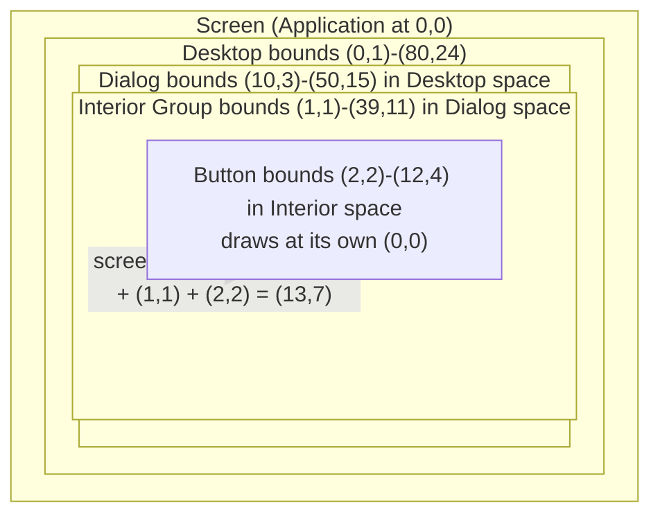
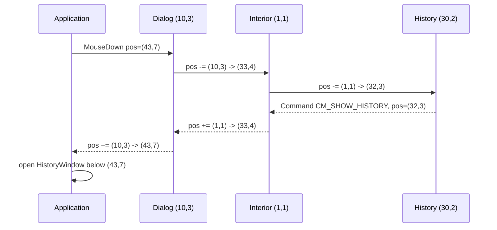

# Owner-Relative Coordinates

Borland's `TView` stores `origin` and `size` relative to its owner. A button at
`(2, 3)` inside a dialog stays at `(2, 3)` no matter where the dialog is dragged;
`TView::writeLine` walks the owner chain to find where that lands on screen, and
`TView::makeLocal` walks it the other way to turn a screen click into a view
coordinate. The crate does not have the owner chain, and until now it compensated
by converting every child's bounds to screen coordinates the moment it was added.
That trade has costs that grew with the 3.0.0 hierarchy work, and this document
describes the change that removes it: children keep owner-relative bounds, views
draw in their own coordinate space, and the translation lives in the two places
that already know about ownership, the `Terminal` and `GroupLike`.

This ships as part of 3.0.0. The tag exists locally and the crate is not yet
published, so the changelog entry is amended rather than a second major release
being opened a day after the first.

## What absolute bounds cost today

`Group::add` and `Window::add` add the owner's origin to the child's bounds.
`group_set_bounds` therefore has to compute a delta and shift every child whenever
a window moves, and `Window` does the same for its frame and its interior `Group`
by hand. Every leaf `draw` reads `self.core.bounds.a` and adds it to each cell it
writes; there are some 270 such sites in the crate and `extras`. Mouse hit tests
compare screen positions against screen bounds, so a view that wants a local
column has to subtract its own origin. `Desktop::add` has to constrain a window
after conversion and not before, a bug that took an issue to find (#95). Tests
that build a dialog and inspect a child have to know where the dialog was placed.

None of this is wrong, but all of it is bookkeeping that the ownership model
already makes unnecessary. A child has exactly one owner, and that owner is on
the stack whenever the child draws or handles an event. The owner can translate.

## The model

`ViewCore.bounds` becomes owner-relative: `a` is Borland's `origin`, `b - a` is
`size`. The accessor keeps its name and type. A view's own coordinate space starts
at `(0, 0)` in its top-left corner, and a new `extent()` on `View` returns
`Rect::new(0, 0, w, h)`, Borland's `getExtent`. `bounds()` is the rectangle the
view occupies in its owner's space; `extent()` is the rectangle it draws into.

`Group::add` and `Window::add` store the bounds they are given. `group_set_bounds`
drops the delta shift and keeps only the grow bits, which is precisely
`TGroup::changeBounds` driving `TView::calcBounds`: a child with `Grow::NONE`
does not move when its owner moves, because its position was always relative.
`Window` no longer recomputes its frame and interior positions on move, only on
resize.

The root of the tree is `Application`. Its menu bar, desktop and status line are
positioned in application space, and since the application fills the screen that
is screen space. Nothing above the application translates.



## Drawing

`Terminal` already keeps a clip stack. It gains an origin stack beside it:

```rust
pub fn push_origin(&mut self, origin: Point);   // accumulates
pub fn pop_origin(&mut self);
fn origin(&self) -> Point;                       // sum of the stack
```

`write_cell`, `write_line`, `read_cell`, `show_cursor` and `push_clip` take
coordinates in the caller's local space and add the accumulated origin before
touching the buffer. Coordinates become `i16` on these calls, because a local
coordinate is allowed to be negative before translation, and the terminal drops
anything that lands off screen as it does now. The clip stack keeps storing screen
rectangles; `push_clip` translates on the way in, so `get_clip_rect` and
`is_clipped` are unchanged.

`group_draw` becomes:

```rust
terminal.push_clip(self.extent().grown(1, 1));      // as today, in local space
for child in children {
    child.set_palette_chain(Some(node.clone()));
    if self.extent().intersects(&child.bounds()) {
        terminal.push_origin(child.bounds().a);
        child.draw(terminal);
        terminal.pop_origin();
    }
}
terminal.pop_clip();
```

The one-cell clip growth stays, so scroll bars that sit on a window frame and the
shadow a window paints outside its own extent keep working exactly as they do
now. There is no per-child clip; a child is free to draw outside its extent, as
Borland's `TView` is, and its owner's clip is what stops it.

`window_draw`, `Desktop::draw` and `Application::draw` follow the same pattern
for the children they hold directly (frame, interior, menu bar, status line).
`group_update_cursor` pushes the focused child's origin before delegating so that
`show_cursor` lands in the right cell. Two helpers in `views::view` capture the
pattern for any view that holds children by value: `draw_child(terminal, child)`
and `dispatch_to_child(child, event)`. Code outside the tree that draws a
top-level view itself, as several examples do in hand-written loops, calls
`terminal.draw_view(&mut view)`, which is the same push, draw, pop. `write_line_to_terminal` and
`draw_shadow_bounds` lose their `y < 0` and `x.max(0)` guards, since the terminal
now clips after translation.

Every leaf `draw` writes at `(0, 0)..(w, h)`. In practice each of the 270 sites
changes from `self.core.bounds.a.x + i` to `i`, and a handful that computed
`bounds.b` for a right edge use `extent().b` or `width()` instead.

## Events

A group receives mouse events in its own local space and dispatches them in the
child's. `group_handle_event` hit-tests children against their relative bounds,
which are already in the group's space, then translates for the child and
translates back on return:

```rust
let origin = child.bounds().a;
event.mouse.pos -= origin;
child.handle_event(event);
event.mouse.pos += origin;
```

The translation back is unconditional. It does not matter whether the child
consumed the event, transformed it into a command, or ignored it: `mouse.pos` is
always in the space of whoever holds the event. That single rule replaces the
owner chain for upward position reporting. `History` already puts its anchor in
`event.mouse.pos` when it turns a click into `CM_SHOW_HISTORY`, and
`ComboBox` does the same for `CM_SHOW_DROPDOWN`; by the time the event reaches
`Application::execute_modal` or `exec_view`, both of which sit at the root, the
anchor is in desktop space without either control knowing where it is.



A dragging or resizing child keeps receiving `MouseMove` and `MouseUp` even when
the pointer has left its extent, as today; the coordinates it sees are simply
local and may be negative. `Window`'s drag code works with the pointer expressed
in its owner's space, which is `local + self.bounds().a`, so the window's new
origin is `pointer_in_owner - drag_offset` and nothing else changes. The desktop
extent replaces the desktop bounds as the limit rectangle.

`make_global` and `make_local` on `View` become one-hop conversions between the
view's space and its owner's, which is all they can be without a chain and all
the crate ever used them for. Their docs say so.

Keyboard, command and broadcast events carry no position and are untouched.

## Positioning helpers

`set_parent_bounds` is renamed `set_owner_extent` and is called with the owner's
extent. A window's drag limits, `Desktop::center_view` and
`constrain_to_parent_bounds` all work against `(0, 0, w, h)`. `Desktop::add` no
longer has to order centering and constraining around a conversion step, because
there is no conversion step. `Dialog::execute` off the desktop passes the desktop
extent as explicit drag limits, as it does now.

`Window::update_frame_child`, `Window::add`, `Desktop::cascade`, `Desktop::tile`
and the zoom logic in `Window` all operate in the owner's space already once the
conversion is gone; they need their comments updated, not their arithmetic.

## What downstream code has to change

A custom view that implemented `View` against 3.0.0 and drew with
`self.bounds().a.x + i` now writes `i`. Where it compared `event.mouse.pos`
against `self.bounds()` it compares against `self.extent()`, or simply reads the
position as a local column and row. Code that positioned a child inside a
`Group` or `Dialog` was already passing owner-relative bounds and does not change.
Code that inspected a child's `bounds()` after adding it and expected screen
coordinates now gets owner coordinates.

The changelog entry for 3.0.0 gains this under its migration section:

```rust
// 3.0.0 before this change: draw at screen position
let x = self.bounds().a.x;
write_line_to_terminal(terminal, x, self.bounds().a.y + row, &buf);
if self.bounds().contains(event.mouse.pos) { .. }

// 3.0.0: draw at (0,0); mouse positions arrive view-local
write_line_to_terminal(terminal, 0, row, &buf);
if self.extent().contains(event.mouse.pos) { .. }
```

## Implementation plan

The work goes in this order so that the tree compiles at every step and each
step is testable on its own.

1. **Terminal.** Add the origin stack, translate in `write_cell`, `write_line`,
   `read_cell`, `show_cursor`, `push_clip`; widen the coordinate parameters to
   `i16`. With an empty stack behaviour is identical, so nothing else changes
   yet. Unit tests: nested pushes accumulate, pop restores, negative local
   coordinates clip, a clip pushed under an origin is stored translated.
2. **`View::extent()`** default method, `set_parent_bounds` renamed to
   `set_owner_extent`, `make_global`/`make_local` documented as one-hop.
3. **Group, Window, Desktop, Application.** Remove the conversion in `add`,
   the delta in `group_set_bounds`, and the frame and interior re-positioning
   on move; push origins in `group_draw`, `window_draw`, `Desktop::draw`,
   `Application::draw` and the cursor path; translate mouse positions in
   `group_handle_event` and in the window's direct dispatch to frame and
   interior. After this step the tree draws children at the wrong place until
   step 4 lands, so 3 and 4 are one commit.
4. **Leaf views.** Every `draw` and mouse handler in `src/views` and
   `extras/src` moves to local coordinates. Mechanical, file by file, guided by
   `grep -n 'bounds.a\.\|bounds().a\.'`.
5. **Tests.** Flip `test_coordinate_conversion_on_add` to assert the bounds are
   stored as given. Add: a desktop holding a window holding a button, drawn into
   `test_terminal`, with the button's text asserted at the computed screen cell;
   the same scene after `set_bounds` moves the window, asserting the child's
   `bounds()` did not change and the cell did; a `MouseDown` on the button
   through `Application::handle_event`, asserting the button saw a local
   position and emitted its command; a frame drag that crosses the window's
   edge; a `History` click whose `CM_SHOW_HISTORY` reaches the root with a
   desktop-space anchor.
6. **Examples and docs.** `cargo build --examples` and fix the examples that
   define their own views. Run `showcase`, `pascal_ide` and a dialog-heavy
   example by hand. Update `CLAUDE.md`'s architecture notes and
   `TURBO-VISION-DESIGN.md`'s coordinate section, add the migration text to
   `CHANGELOG.md` under 3.0.0, and move the `v3.0.0` tag.

Gate for each commit: warning-free `cargo build --workspace --all-targets` and a
green `cargo test --workspace`, committed with `--no-verify` as for the rest of
the 3.0.0 work.

## Decisions taken and alternatives not taken

Two smaller designs were considered. The first kept views drawing at
`self.bounds().a` and added only the origin stack, so that a view's bounds were
owner-relative but its draw code untouched. It saves the 270 edits but leaves
every view mixing two spaces, which is the confusion this change is meant to
remove. The second passed an explicit `DrawContext { origin, clip }` into
`View::draw` instead of storing the origin in the terminal. It is the more
explicit API, but it changes the `View` signature for every downstream crate a
second time and buys nothing the terminal stack does not, since a view already
receives the terminal and never needs to see the origin.

For mouse positions the alternative was to keep screen coordinates in the event
and cache each view's screen origin in `ViewCore`, refreshed at draw time the way
the palette chain is. The cache is stale between a move and the next draw, and
every handler has to remember to convert. Translating at the group boundary has
neither problem and matches how the palette chain is already pushed down.
