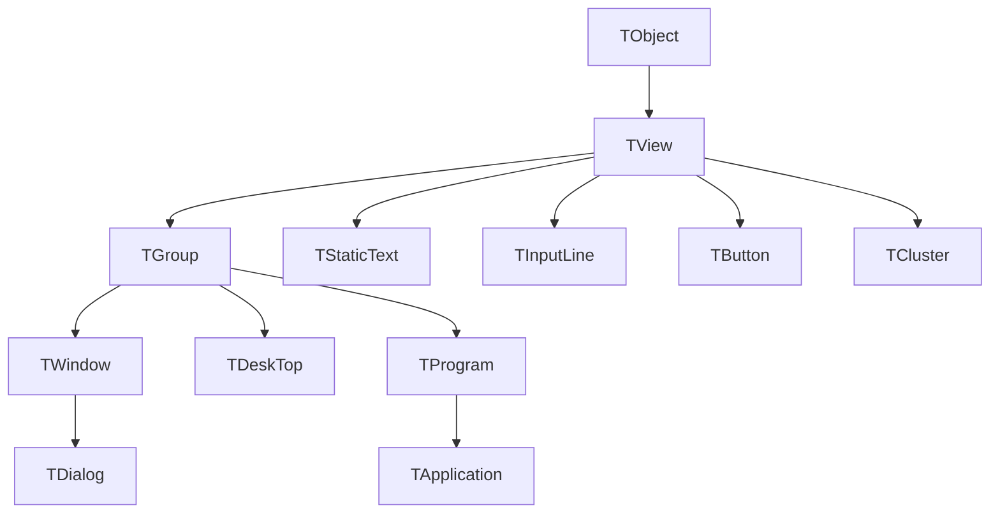
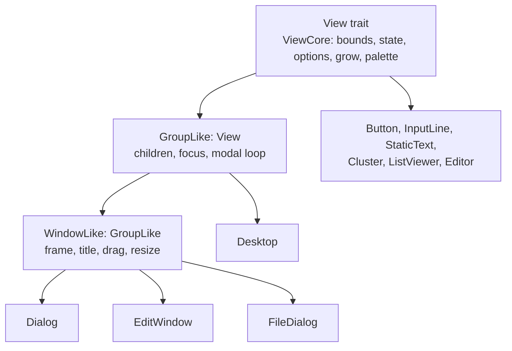
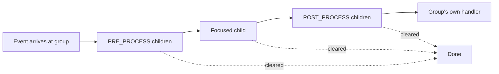

# The application model, side by side

## The class tree, and what happened to it

Borland's framework is a single-rooted hierarchy. Everything visible is a `TView`, a container is a
`TGroup`, a framed container is a `TWindow`, and a modal one is a `TDialog`.



Rust has no implementation inheritance, so the same tree is expressed as layered traits over shared
core structs. The layers carry exactly what the base classes carried.



`Application` is not in that tree. Where `TProgram` was itself a group holding the menu bar, the
status line and the desktop, `Application` owns them as fields and runs the loop. It is a driver,
not a view.

## Writing a view

=== "C++"

    ```cpp
    class TMyView : public TView
    {
    public:
        TMyView(TRect bounds) : TView(bounds)
        {
            options |= ofSelectable;
            growMode = gfGrowHiX;
        }

        virtual void draw();
        virtual void handleEvent(TEvent &event);
        virtual TPalette &getPalette() const;
    };

    void TMyView::draw()
    {
        TDrawBuffer b;
        b.moveStr(0, "Hello", getColor(1));
        writeLine(0, 0, size.x, 1, b);
    }
    ```

    The base class holds `origin`, `size`, `state`, `options` and `growMode`. You inherit them and
    may forget to maintain them.

=== "Rust"

    ```rust
    pub struct MyView {
        core: ViewCore,
    }

    impl MyView {
        pub fn new(bounds: Rect) -> Self {
            let mut core = ViewCore::new(bounds);
            core.options |= Options::SELECTABLE;
            core.grow_mode = Grow::HI_X;
            Self { core }
        }
    }

    impl View for MyView {
        fn core(&self) -> &ViewCore { &self.core }
        fn core_mut(&mut self) -> &mut ViewCore { &mut self.core }
        fn as_any(&self) -> &dyn std::any::Any { self }
        fn as_any_mut(&mut self) -> &mut dyn std::any::Any { self }

        fn draw(&mut self, terminal: &mut Terminal) { /* write at (0, 0) */ }
        fn handle_event(&mut self, event: &mut Event) { /* clear to consume */ }
        fn get_palette(&self) -> Palette { /* ... */ }
    }
    ```

    The same five fields live in one `ViewCore`. The ten accessors are trait defaults that read it,
    so a view cannot report a state it does not have.

The four required methods beyond the two core accessors are the same four virtuals you overrode in
C++, plus the two downcast hooks that replace `dynamic_cast`.

## Writing a window

This is where the two languages diverge most, and where the macro earns its place.

=== "C++"

    ```cpp
    class TMyWindow : public TWindow
    {
    public:
        TMyWindow(TRect r) : TWindowInit(&TMyWindow::initFrame),
                             TWindow(r, "Title", wnNoNumber) {}

        virtual void handleEvent(TEvent &event)
        {
            TWindow::handleEvent(event);   // the base call
            if (event.what == evCommand && event.message.command == cmMine)
            {
                doSomething();
                clearEvent(event);
            }
        }
    };
    ```

=== "Rust"

    ```rust
    pub struct MyWindow {
        window: Window,
    }

    impl GroupLike for MyWindow {
        fn group(&self) -> &Group { self.window.group() }
        fn group_mut(&mut self) -> &mut Group { self.window.group_mut() }
    }

    impl WindowLike for MyWindow {
        fn window(&self) -> &Window { &self.window }
        fn window_mut(&mut self) -> &mut Window { &mut self.window }
    }

    impl_view_for_window!(MyWindow {
        fn handle_event(&mut self, event: &mut Event) {
            self.window_handle_event(event);   // the base call
            if event.what == EventType::Command && event.command == CM_MINE {
                self.do_something();
                event.clear();
            }
        }
    });
    ```

`self.window_handle_event(event)` is `TWindow::handleEvent(event)`. The naming convention is the
whole trick: a trait cannot have a method with the same name as one on `View` without making every
call ambiguous, so `GroupLike` and `WindowLike` prefix their bodies with `group_` and `window_`,
and the macro wires the `View` implementation to whichever of them you did not override.

Dispatch stays late-bound. `window_draw` paints with `self.get_palette()`, and if `MyWindow`
overrides `get_palette`, the base drawing code uses the override, exactly as a virtual call would.

## The application object

=== "C++"

    ```cpp
    class TMyApp : public TApplication
    {
    public:
        TMyApp();
        static TMenuBar *initMenuBar(TRect r);
        static TStatusLine *initStatusLine(TRect r);
        virtual void handleEvent(TEvent &event);
        virtual void idle();
    };

    int main()
    {
        TMyApp app;
        app.run();
        return 0;
    }
    ```

    The base constructor calls your static `init*` functions while the object is still being built,
    and `handleEvent` is a virtual you override.

=== "Rust"

    ```rust
    struct MyApp;

    impl AppHandler for MyApp {
        fn pre_event(&mut self, app: &mut Application, event: &mut Event) {}
        fn handle_command(
            &mut self,
            app: &mut Application,
            command: CommandId,
            _event: &Event,
        ) -> bool {
            match command {
                CM_MINE => { /* ... */ true }
                _ => false,
            }
        }
        fn idle(&mut self, app: &mut Application) {}
        fn window_closed(&mut self, app: &mut Application, id: ViewId) {}
    }

    fn main() -> turbo_vision::core::error::Result<()> {
        let mut app = Application::new()?;
        app.set_menu_bar(build_menu_bar(&app));
        app.set_status_line(build_status_line(&app));
        app.run_with(&mut MyApp)?;
        Ok(())
    }
    ```

    You build the menu bar and status line yourself and hand them over, so there is no
    partly-constructed object and no ordering rule to remember. `AppHandler` holds the four hooks
    that were virtuals.

Every hook has a direct ancestor. `pre_event` is `TApplication::handleEvent` running before the
desktop sees the event. `handle_command` is the `case cmXxx` block after it. `idle` is
`TProgram::idle`. `window_closed` is the cleanup that followed `TDeskTop` deleting a window.

## Events

The dispatch order is unchanged: a group offers the event to its `PRE_PROCESS` children, then to
the focused child, then to its `POST_PROCESS` children, and a handler that acts on an event clears
it.



| C++ | Rust |
|---|---|
| `event.what == evCommand` | `event.what == EventType::Command` |
| `event.message.command` | `event.command` |
| `clearEvent(event)` | `event.clear()` |
| `message(target, evBroadcast, cmX, ptr)` | `group.broadcast(..)` |
| `putEvent(event)` | post a command event on the queue |

## Coordinates

Both frameworks store a view's position relative to its owner. Borland kept `origin` owner-relative
and translated on the way to the screen; version 3.0.0 of this crate does the same, after two
releases in which bounds became absolute once a view was added.

| | C++ | Rust 3.0.0 |
|---|---|---|
| Position | `origin`, relative to owner | `bounds()`, relative to owner |
| Own space | `TRect(0, 0, size.x, size.y)` | `extent()` |
| Drawing | `writeLine` translates | `draw` writes at `(0, 0)`; the terminal's origin stack translates |
| Mouse | `makeLocal(event.mouse.where)` | already local when it reaches you |
| To owner space | `makeGlobal` | `make_global`, one hop |

The mechanics are in [owner-relative coordinates](../reference/owner-coordinates.md).

## Ownership, and what replaced the pointers

C++ Turbo Vision is built on raw pointers that are never null and never deleted twice, by
convention. Three of those conventions needed a replacement.

**The owner back-pointer.** Views here have none. A control tells its owner something by posting a
command, and the owner acts. `History` posts `CM_SHOW_HISTORY`; the dialog opens the popup and
writes the result into the input line it holds a handle to.

**`dynamic_cast`.** `View::as_group()` is the `TGroup*` cast, and it is how base code reaches the
modal end state. For a concrete type, `as_any().downcast_ref::<Button>()` does the rest. Both are
why `as_any` and `as_any_mut` are required rather than optional.

**The `link` pointer.** A C++ control that needed a sibling stored a pointer to it. Here the owner
holds a `Handle<T>` and resolves it through its own child list, which is why sibling coordination
lives in the owner's `handle_event` rather than in the control.

## Flags

The bit masks are the same bits, wrapped so they cannot be mixed up.

| C++ | Rust | Test |
|---|---|---|
| `sfVisible`, `sfActive`, `sfModal` | `State::VISIBLE`, `State::ACTIVE`, `State::MODAL` | `state.contains(State::MODAL)` |
| `ofSelectable`, `ofPreProcess` | `Options::SELECTABLE`, `Options::PRE_PROCESS` | `options.intersects(..)` |
| `gfGrowHiX`, `gfGrowAll` | `Grow::HI_X`, `Grow::ALL` | |
| `mfOKButton`, `mfError` | `MsgBox::OK_BUTTON`, `MsgBox::ERROR` | |

Never compare one against zero; use `contains` or `intersects`.

## Commands

The numbers are Borland's, in ranges with owners.

| Range | Belongs to |
|---|---|
| 0-99 | Borland's standard commands: `CM_QUIT`, `CM_OK`, `CM_CANCEL`, the `editors.h` file set |
| 100-199 | This crate's internal commands and broadcasts |
| 200 and up | Your application. Start at `CM_USER`. |

One rule changed. In C++, and in 2.x of this crate, a command below a threshold closed a modal
dialog. Now a `CloseOn` policy names them: by default the standard four plus the commands of the
buttons the dialog holds. Any other child's command passes through to the caller, so a list box can
post whatever number it likes without the dialog vanishing.

## Porting checklist

1. Turn each class into a struct with a `ViewCore` field, or a `Window` field for a window-shaped
   type, and implement `View` or `WindowLike` plus `impl_view_for_window!`.
2. Replace base-class calls with the `group_*` or `window_*` name.
3. Delete `origin`-to-screen arithmetic. Draw at `(0, 0)`, test the mouse against `extent()`.
4. Replace `owner->` with a posted command handled by the owner.
5. Replace stored sibling pointers with a `Handle<T>` the owner resolves.
6. Renumber application commands to start at `CM_USER`, and set a `CloseOn` policy if a dialog
   should close on something unusual.
7. Swap bit masks for the flag newtypes and their `contains` tests.
8. Replace `init*` static overrides with values built in `main` and handed to `set_menu_bar` and
   `set_status_line`, and put your event handling in an `AppHandler`.
