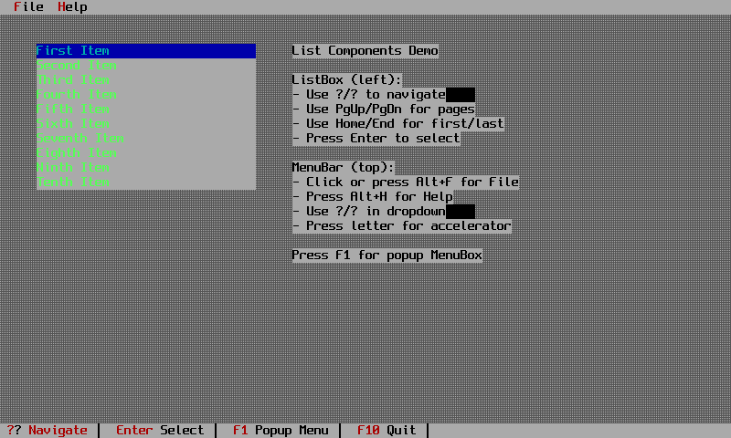
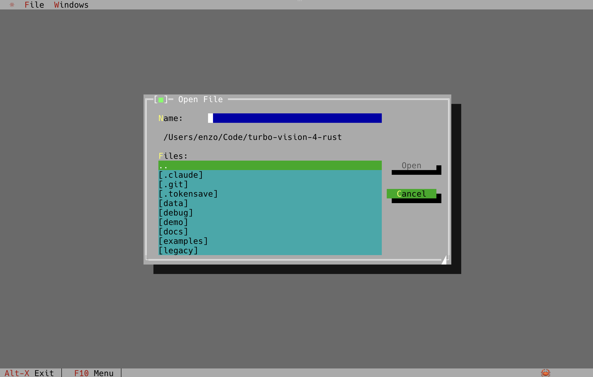
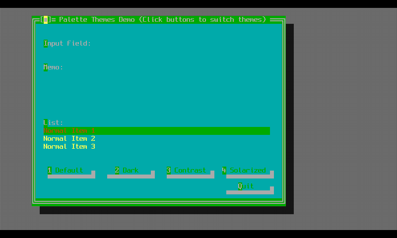

# Examples

The repository ships 48 runnable examples under `examples/`. They are not decoration: building them
all is how the crate checks that its public API still works from outside, so any change that breaks
a downstream program breaks the example build first.

```bash
cargo run --example showcase     # run one
cargo build --examples           # build all 48
```

!!! warning "Quit with Alt+X"
    These are full-screen terminal applications. Leave through the application, not by closing the
    terminal window, or you will be left in raw mode.

## Start here

| Example | Lines | What it shows |
|---|---:|---|
| `quick_start_00` .. `quick_start_05` | 10-130 | The application shell, assembled one piece at a time. Walked through in [the quick start tutorial](../tutorials/quick-start.md). |
| `minimal_app` | 80 | A status line and a window, no menu bar. The equivalent of deriving from `TProgram` instead of `TApplication`. |
| `dialogs` | 64 | The three standard library dialogs. |
| `showcase` | 1785 | The broad demo: calculator, calendar, ASCII table and puzzle windows, overlapping with shadows and z-order. |


## By subject

### Application shell

- **`menu_status`** &mdash; a menu bar with submenus, a right-click context menu, and a status line with hot spots and hints.
- **`command_set`** &mdash; buttons that enable and disable themselves as application state changes, driven by the global command set.
- **`function_keys`** &mdash; F1 through F10, and what actually arrives from the terminal.
- **`desktop_logo`** &mdash; a custom desktop background, ported from Borland's `desklogo` example.
- **`dynamic_title`** &mdash; changing a window title while the application runs.


### Windows and layout

- **`window_resize`** &mdash; dragging, resizing and the growth modes that decide how children follow.
- **`test_window_overlap`** &mdash; modal against non-modal, and what a modal window blocks.
- **`broadcast`** &mdash; a standalone group distributing a broadcast to its children.
- **`wrong_owner`** &mdash; a deliberate mistake: a button that reports the wrong owner type and picks up the wrong palette. Useful when your colours look off.

### Controls

- **`new_controls`** &mdash; the widgets added beyond the Borland set, on two tabbed pages.
- **`cluster_tooltip`** &mdash; multi-item check box and radio clusters, tooltips, and the frame zoom triangle.
- **`list_components`** &mdash; the list viewer family end to end.
- **`sorted_listbox`** &mdash; a sorted list with binary search and type-ahead.
- **`tree_view`** &mdash; a hierarchical outline view.
- **`progress_bar`** &mdash; determinate and marquee bars, animated as overlay widgets.
- **`label_link`** &mdash; labels that focus the input field they are linked to.
- **`validator`** &mdash; every validator type in one dialog: filter, range and picture.




### Files and the editor

- **`file_dialog`** &mdash; the open and save dialogs.
- **`file_browser`** &mdash; a directory tree beside a file list.


- **`pascal_ide`** &mdash; the editor from the Bruto-Pascal project, with a breakpoint gutter and Pascal syntax highlighting. The most complex example in the tree.


### Colour and text

- **`palette_themes`** &mdash; replacing the application palette at runtime.
- **`text_styling`** &mdash; a table of every text style the terminal layer can emit.
- **`kitty_image`**, **`kitty_background`**, **`kitty_biorhythm`** &mdash; real images in the terminal through the Kitty graphics protocol.



### Terminal and plumbing

- **`terminal_widget`** &mdash; a scrolling output viewer fed by a simulated build log, matching Borland's `terminal.cc`.
- **`log_window`** &mdash; `tracing` output routed into a scrollable window.
- **`suspend_resume`** &mdash; handing the terminal back to the shell and taking it again.
- **`screenshot`** &mdash; the built-in screen capture shortcuts.
- **`beep`** &mdash; audio feedback.
- **`ssh_server`** &mdash; serving the application over SSH. Requires `--features ssh`.
- **`test_events`**, **`test_mouse`** &mdash; diagnostic tools that print every event, for when a key or a click is not arriving.

### Whole applications

- **`biorhythm`** &mdash; the calculator built in [the tutorial](../tutorials/biorhythm.md): a validated date form and a custom chart view.
- **`ui_features`** &mdash; beeps, dynamic titles and message boxes together.


## Reading an example

Four of them are picked apart in [the walkthroughs](walkthroughs.md).
