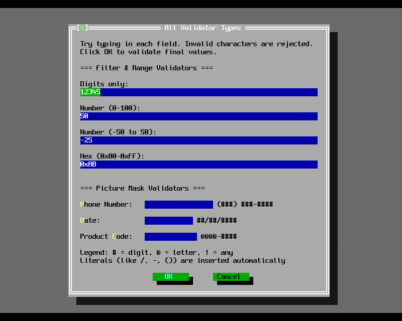
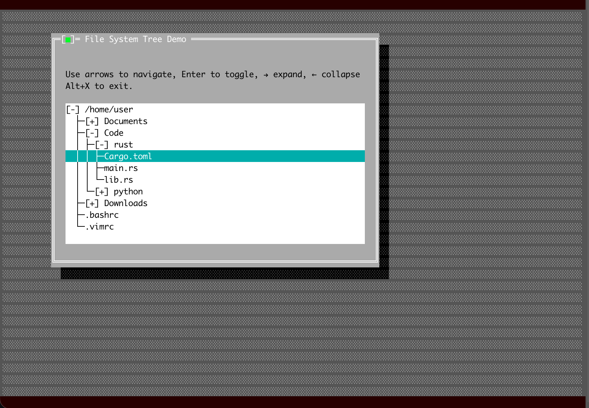

# Example walkthroughs

Four examples, read closely. Each one teaches a pattern you will reuse.

## `dialogs`: the standard boxes

Sixty lines, no event loop, no views constructed by hand. Every standard dialog is a function that
runs its own modal loop and returns a value.

```rust title="examples/dialogs.rs"
message_box_ok(&mut app, "Welcome to the Dialogs Demo!");
message_box_error(&mut app, "This is an error message.");
message_box_warning(&mut app, "This is a warning message.");

let result = confirmation_box(&mut app, "Do you want to save changes?");
let action = match result {
    r if r == CM_YES => "You chose: Yes",
    r if r == CM_NO => "You chose: No",
    _ => "You chose: Cancel",
};

if let Some(name) = input_box(&mut app, "Input Box", "Enter your name:", "", 50) {
    message_box_ok(&mut app, &format!("Hello, {name}!"));
}
```

The pattern to take away: **a modal dialog is a function call that returns the command that closed
it.** The loop, the focus handling and the redraw all happen inside. `input_box` returns an
`Option<String>`, so a cancelled prompt is `None` rather than an empty string you have to
second-guess.

Note that `main` never calls `app.run()`. The application object exists to own the terminal and the
desktop; the program is just a sequence of modal boxes.

## `validator`: fields that refuse bad data



This is the example to copy when you build a form.

```rust title="examples/validator.rs"
let validator = Rc::new(RefCell::new(FilterValidator::new("0123456789")));
let input = InputLineBuilder::new()
    .bounds(Rect::new(2, y, dialog_width - 4, y + 1))
    .max_length(20)
    .text("12345")
    .validator(validator.clone())
    .build();
let field = dialog.add_typed(input);
```

Three ideas are stacked here.

A **validator is shared**, held in an `Rc<RefCell<_>>`, because the input line consults it on every
keystroke while your code may still want to inspect it. `FilterValidator` rejects characters outside
its set as they are typed. `RangeValidator` and `PictureValidator` check the whole field when the
dialog tries to close, so an out-of-range number is caught at OK, not mid-typing.

`add_typed` returns a **typed handle**. In 3.0.0 an input line owns its own text, so you no longer
pass a shared string in and read it out sideways. You keep the handle and ask the dialog for the
child once the dialog has closed:

```rust
fn text_of(dialog: &Dialog, field: Handle<InputLine>) -> String {
    dialog.get(field).map(|f| f.text().to_string()).unwrap_or_default()
}
```

This is the crate's answer to a problem C++ solved with raw pointers into the view tree. The handle
is checked, the borrow is short, and nothing outlives the dialog.

## `tree_view`: a custom event loop



Most programs should implement `AppHandler` and call `run_with`. This example writes the loop out
instead, which makes the three steps visible.

```rust title="examples/tree_view.rs"
loop {
    app.terminal.draw_view(&mut app.desktop);
    let _ = app.terminal.flush();

    if let Some(mut event) = app.terminal.poll_event(Duration::from_millis(50)).ok().flatten() {
        turbo_vision::views::view::dispatch_to_child(&mut app.desktop, &mut event);

        if event.what == EventType::Keyboard && event.key_code == KB_ALT_X {
            break;
        }
    }
}
```

`draw_view` and `dispatch_to_child` are the 3.0.0 entry points for code that sits outside the view
tree. They push the desktop's origin before drawing and translate the mouse position before
dispatching, then undo both afterwards. Calling `desktop.draw(&mut terminal)` directly would draw
in the wrong space.

The check after dispatch is the important habit: a handler that consumed the event clears it, so by
testing afterwards you only see what nothing else wanted.

The tree itself is an `OutlineViewer` built over `Node<T>` values, with a closure turning each node
into its display string:

```rust
let mut tree_view = OutlineViewer::new(Rect::new(2, 5, 64, 17), |name: &String| name.clone());
tree_view.add_root(root);
```

## `wrong_owner`: a bug on purpose

Fifty lines that produce a button with the wrong colours, and it is the fastest way to understand
the palette chain.

```rust title="examples/wrong_owner.rs"
let mut window = WindowBuilder::new()
    .bounds(Rect::new(20, 5, 60, 15))
    .title("Window with Button")
    .build();

let button = ButtonBuilder::new()
    .bounds(Rect::new(10, 4, 30, 6))
    .title("~T~est Button")
    .command(CMD_TEST)
    .build();
window.add(button);
```

A button belongs in a dialog. Put one straight into a plain window and it still draws, still takes
focus and still posts its command, but its colours come out wrong, because a view does not carry
absolute colours. It carries indices into the palette of whatever owns it, and a window's palette
and a dialog's palette have different things at those indices. Borland behaved the same way, and it
was the classic source of "why is my button brown".

If your control's colours look wrong, this example is the first thing to compare against, then
[chapter 14](../guide/chapter-14.md).
