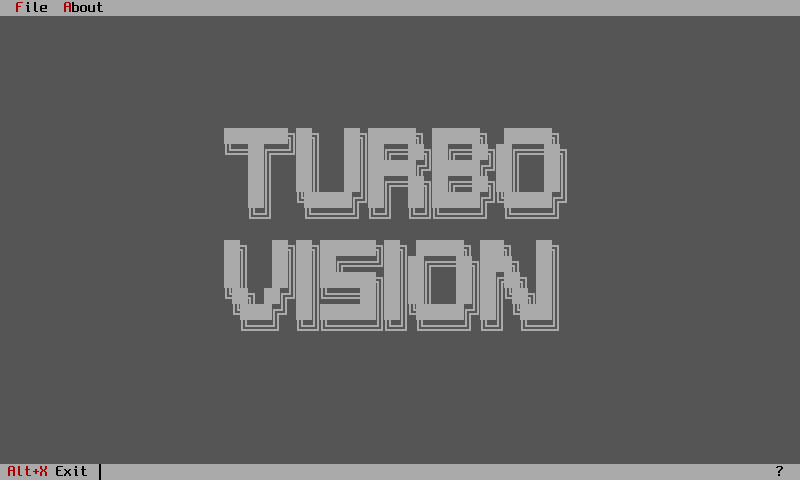
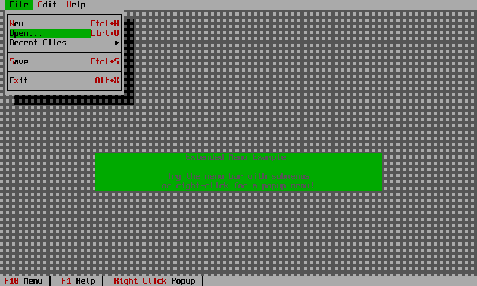

# Getting started

## Install

Add the crate to your project:

```bash
cargo add turbo-vision
```

Or in `Cargo.toml`:

```toml
[dependencies]
turbo-vision = "3.0"
```

Two optional features exist. `ssh` builds the SSH backend so an application can be served over a
network connection. `test-util` exposes the mock terminal so your own tests can draw views and read
cells back.

```toml
turbo-vision = { version = "3.0", features = ["ssh"] }
```

## The smallest application

```rust
use turbo_vision::prelude::*;

fn main() -> turbo_vision::core::error::Result<()> {
    let mut app = Application::new()?;
    app.run();
    Ok(())
}
```

That gives you the blue desktop and nothing else. `Application::new` claims the terminal, puts it
in raw mode and installs the desktop; `run` is the event loop. Press Alt+X to leave.



## Adding a status line

The status line is a view you build and hand to the application. Each item pairs a display string,
a key chord and a command. The tildes mark the highlighted letter, exactly as in Borland's
resource strings.

```rust
use turbo_vision::core::status_data::StatusItemBuilder;
use turbo_vision::prelude::*;
use turbo_vision::views::status_line::StatusLine;

fn setup_status_line(app: &Application) -> StatusLine {
    let (w, h) = app.terminal.size();
    StatusLine::new(
        Rect::new(0, h as i16 - 1, w as i16, h as i16),
        vec![
            StatusItemBuilder::new()
                .text("~Alt-X~ Exit")
                .key("Alt+X")
                .command(CM_QUIT)
                .build(),
        ],
    )
}
```

An unrecognised chord panics the first time the application runs, so a typo surfaces immediately
rather than becoming a dead key.

## Adding a menu bar

```rust
use turbo_vision::core::menu_data::{Menu, MenuItem, MenuItemBuilder};
use turbo_vision::views::menu_bar::{MenuBar, SubMenu};

fn setup_menu_bar(app: &Application) -> MenuBar {
    let file_items = vec![
        MenuItemBuilder::new().text("~O~pen...").command(CM_OPEN).key("Ctrl+O").build(),
        MenuItem::separator(),
        MenuItemBuilder::new().text("E~x~it").command(CM_QUIT).key("Alt+X").build(),
    ];

    let (w, _) = app.terminal.size();
    let mut menu_bar = MenuBar::new(Rect::new(0, 0, w as i16, 1));
    menu_bar.add_submenu(SubMenu::new("~F~ile", Menu::from_items(file_items)));
    menu_bar
}
```

Register both with `app.set_status_line(..)` and `app.set_menu_bar(..)` before calling `run`.

## Handling your own commands

Application commands start at `CM_USER`, which is 200. Implement `AppHandler` and pass it to
`run_with` rather than writing your own loop.

```rust
use turbo_vision::app::application::AppHandler;

const CM_ABOUT: CommandId = CM_USER;

struct MyApp;

impl AppHandler for MyApp {
    fn handle_command(
        &mut self,
        app: &mut Application,
        command: CommandId,
        _event: &Event,
    ) -> bool {
        match command {
            CM_ABOUT => {
                message_box_ok(app, "A Turbo Vision application.");
                true
            }
            _ => false,
        }
    }
}
```

Returning `true` marks the command consumed. Start the program with `app.run_with(&mut MyApp)`.

## Running the bundled examples

The repository carries 48 examples that double as the downstream API test.

```bash
git clone https://github.com/aovestdipaperino/turbo-vision-4-rust
cd turbo-vision-4-rust
cargo run --example showcase      # a broad feature demo
cargo run --example pascal_ide    # the editor, with syntax highlighting
cargo build --examples            # build them all
```



!!! warning "Leave the application before closing the terminal"
    Quit with Alt+X. Killing the terminal while an example is running leaves it in raw mode.

## Where to go next

Chapter 1 of the [user guide](guide/index.md) builds a complete application from an empty desktop
up to a validated data-entry form. The [tutorials](tutorials/index.md) work through whole projects.
If you are arriving from C++, start with [the application model comparison](compare/app-model.md).
