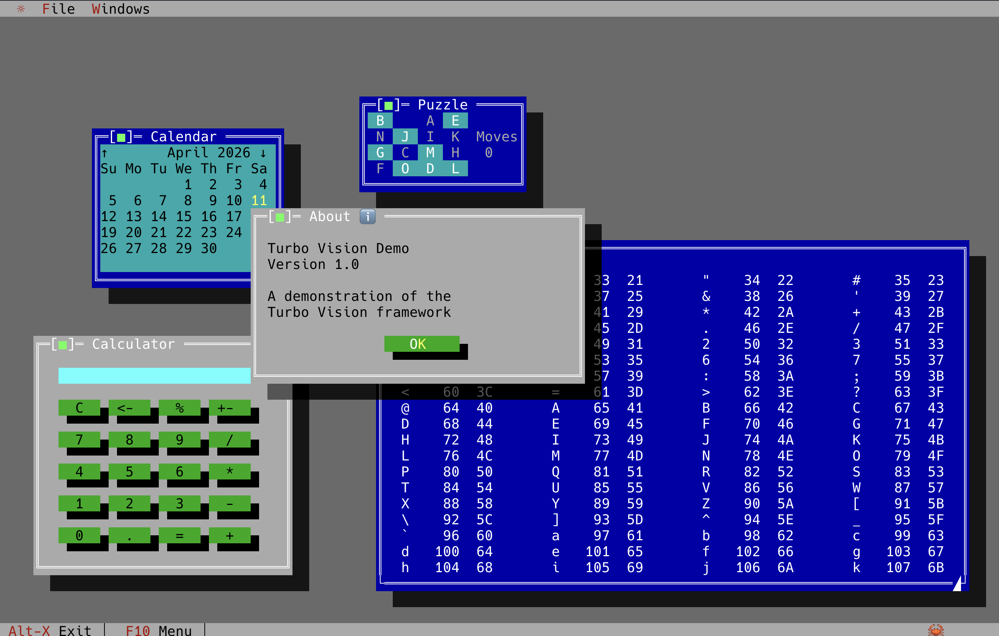
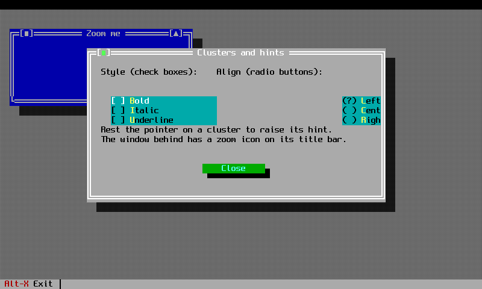

# User guide

Eighteen chapters, adapted from the Borland Turbo Vision guide and rewritten against the Rust API.
The first six build one application from nothing. The next three explain how the framework works
underneath. The rest are reference chapters, one per object family.

## Building an application

Work through these in order. Each chapter starts from where the last one finished.

-   **[1. Stepping into Turbo Vision](chapter-01.md)**

    An empty desktop, a status line, a menu bar. What `Application` does when it starts.

-   **[2. Responding to commands](chapter-02.md)**

    Commands, the command set, enabling and disabling items, and the handler that receives them.

-   **[3. Adding windows](chapter-03.md)**

    Windows on the desktop, frames, z-order, dragging, resizing and closing.

-   **[4. Persistence and configuration](chapter-04.md)**

    Saving what the user set up and reading it back on the next run.

-   **[5. Creating data-entry forms](chapter-05.md)**

    Dialogs, input lines, clusters, buttons and the modal loop that runs them.

-   **[6. Managing data collections](chapter-06.md)**

    List boxes, sorted collections and the viewers that scroll them.

## How the framework works

- **[7. Architecture overview](chapter-07.md)** &mdash; the layers, and what replaced the C++ class tree.
- **[8. Views and groups](chapter-08.md)** &mdash; the `View` trait, `GroupLike`, `WindowLike`, and owner-relative coordinates.
- **[9. Event-driven programming](chapter-09.md)** &mdash; the three-phase dispatch, focus, broadcasts and how a handler consumes an event.

## Object reference

| Chapter | Covers |
|---|---|
| [10. Application objects](chapter-10.md) | `Application`, the desktop, the modal loop, idle handling |
| [11. Windows and dialogs](chapter-11.md) | `Window`, `Dialog`, frames, `CloseOn`, end states |
| [12. Control objects](chapter-12.md) | Buttons, input lines, clusters, scroll bars, list and combo boxes |
| [13. Data validation](chapter-13.md) | Filter, range and picture validators |
| [14. Palettes and colour](chapter-14.md) | The palette chain and the Borland colour tables |
| [15. Editor and text views](chapter-15.md) | The editor, file editor, selection, clipboard and undo |
| [16. Collections and streams](chapter-16.md) | Collections, sorted collections, iteration |
| [17. Streams and persistence](chapter-17.md) | Serialising a view tree and reading it back |
| [18. Resources](chapter-18.md) | Resource files and string tables |
