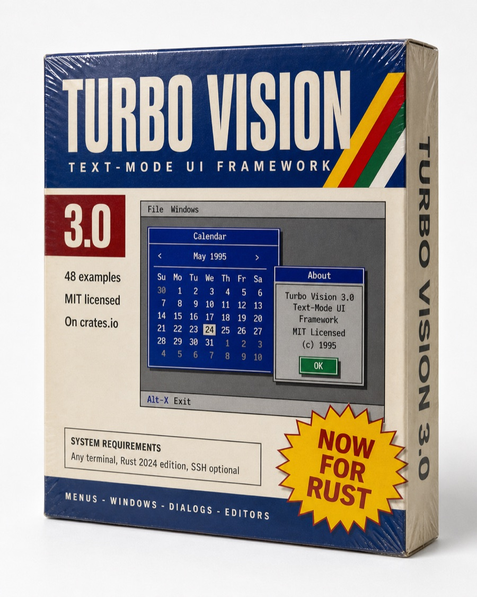
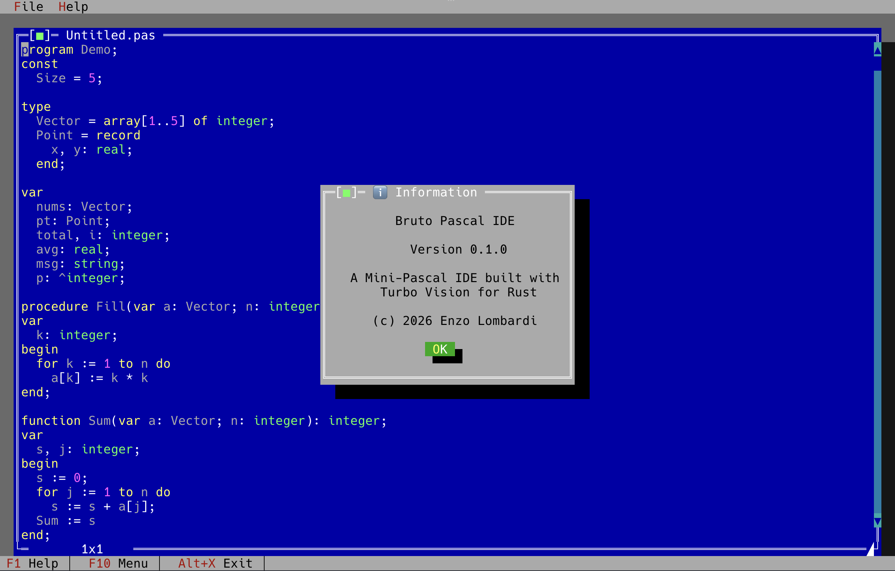
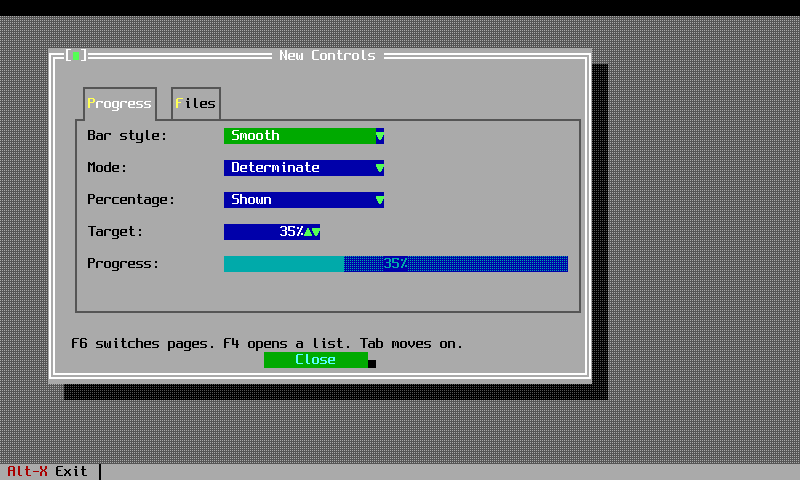

---
hide:
  - navigation
---

# Turbo Vision for Rust

<div class="tv-hero" markdown>

<div class="tv-hero__text" markdown>

<p class="tv-tagline">The Borland text-mode UI framework, rebuilt in Rust. Menus, windows, dialogs,
validators, editors and palettes, drawn in a terminal, on a desktop that still looks like 1991.</p>

[Get started](getting-started.md){ .md-button .md-button--primary }
[What's new](whats-new.md){ .md-button }
[Browse the user guide](guide/index.md){ .md-button }

</div>

<div class="tv-hero__box">

</div>

</div>


## What it gives you

The crate is a full port of Borland's class library, not a lookalike. The class tree
`TView` &rarr; `TGroup` &rarr; `TWindow` &rarr; `TDialog` survives as a stack of Rust traits, the
event model is the same three-phase dispatch, the palettes are the original Borland colour tables,
and the commands still start at `cmQuit`. If you wrote Turbo Vision in Pascal or C++ you already
know most of this library.

<div class="grid cards" markdown>

-   :material-application-outline: **An application shell**

    A menu bar, a status line, a desktop with draggable, resizable, shadowed windows, and
    a modal loop that behaves like `TProgram::run`.

-   :material-form-textbox: **Real controls**

    Input lines, buttons, check boxes, radio buttons, list boxes, combo boxes, scroll bars,
    trees, split panes, progress bars, tooltips and history dropdowns.

-   :material-check-decagram: **Validators**

    Filter, range and picture validators, wired into input lines the way Borland wired them,
    so a dialog refuses to close on bad data.

-   :material-file-document-edit: **An editor**

    A text editor view with selection, clipboard, undo and syntax highlighting, plus the
    file-open and change-directory dialogs that go with it.

-   :material-palette: **The Borland palettes**

    The palette chain is pushed down the view tree at draw time, so a control picks up its
    colour from the window that owns it, exactly as the original did.

-   :material-console-network: **A terminal layer**

    A `Backend` trait with a crossterm implementation, an optional SSH server behind a feature
    flag, and a mock terminal your tests can draw into and read cells back from.

</div>

## Thirty seconds of code

```rust
use turbo_vision::core::status_data::StatusItemBuilder;
use turbo_vision::prelude::*;
use turbo_vision::views::status_line::StatusLine;

fn main() -> turbo_vision::core::error::Result<()> {
    let mut app = Application::new()?;

    let (w, h) = app.terminal.size();
    app.set_status_line(StatusLine::new(
        Rect::new(0, h as i16 - 1, w as i16, h as i16),
        vec![
            StatusItemBuilder::new()
                .text("~Alt-X~ Exit")
                .key("Alt+X")
                .command(CM_QUIT)
                .build(),
        ],
    ));

    app.run();
    Ok(())
}
```

## Where to go next

| If you want to | Read |
|---|---|
| Build your first application | [Getting started](getting-started.md) then [Chapter 1](guide/chapter-01.md) |
| Follow a complete worked project | [The biorhythm calculator tutorial](tutorials/biorhythm.md) |
| Understand the trait layering | [Views and groups](guide/chapter-08.md) and [the design document](reference/design.md) |
| Port a C++ Turbo Vision program | [The application model, side by side](compare/app-model.md) |
| See what changed in 3.0.0 | [What's new](whats-new.md) |
| Move an existing project onto 3.0.0 | [The upgrade guide](reference/upgrading.md) |

## It looks like this

<div class="grid" markdown>







</div>

## Credits

Built by Enzo Lombardi, from Borland's original Turbo Vision 2.0 and the
[kloczek C++ port](https://github.com/kloczek/tvision). MIT licensed.
