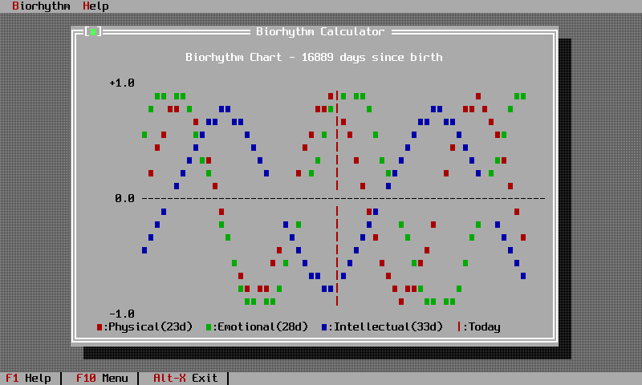

# Tutorials

Complete projects, built step by step. Where the [user guide](../guide/index.md) explains one topic
per chapter, a tutorial carries a single program from an empty `main` to something you would ship.

-   :material-numeric-1-box: **[Quick start, in six steps](quick-start.md)**

    The `quick_start_00` through `quick_start_05` examples, explained. An empty desktop grows a
    status line, a menu bar, real commands and finally global keyboard shortcuts. About twenty
    minutes.

-   :material-chart-line: **[The biorhythm calculator](biorhythm.md)**

    A full application: a data-entry dialog with a validated date field, a custom view that draws
    sine curves in text, window management and a status line. The longest worked example in the
    documentation.

## Suggested order

1. Read [getting started](../getting-started.md) and get an empty desktop running.
2. Work through the [quick start](quick-start.md) to see the application shell assemble.
3. Build the [biorhythm calculator](biorhythm.md) for dialogs, validation and custom drawing.
4. Read [chapter 8](../guide/chapter-08.md) when you want to write a view of your own.
